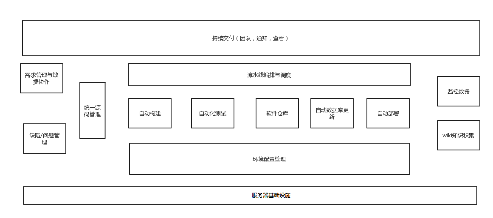
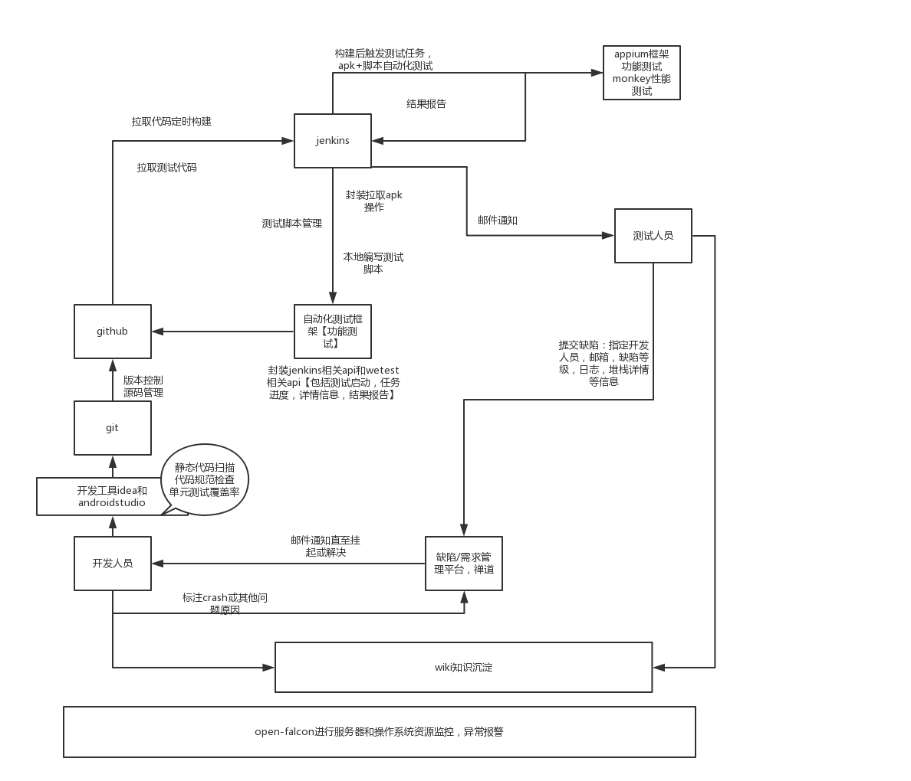

### 1、设计思路

------

1、背景及目的

 开发、测试和运维各自有自己的一套工具来完成自己关心的任务，而这些工具既不相同，也不相互关联；软件包在不同工具之间的转移更多依靠人工来完成；由于工具上的割裂，每个人并不清楚同一个变更在其它角色哪里到底发生了什么，也不关心。

 DevOps 是一种思考方式。根据这个思想来看，在理想的世界里，开发人员、系统管理员和业务相关人将作为一个团队工作。虽然他们可能不完全了解彼此的世界，可能没有足够的知识去了解彼此的积压任务，但他们在大多数情况下能有一致的看法。DevOps本质上是关于开发，测试，运维的协作。因为大家都理解彼此，所以有助于消除以往的壁垒，在“为用户创造最大化价值”的一致目标下，让软件交付给用户并获得反馈的过程更加敏捷，至于要不要将开发运维一体化，则取决于具体产品的特征，在不同场景下可以有不同的协作模式，即DevOpse可以有多种表现形式。

------

2、任务简介

 1、熟悉使用linux系统，ZenTao禅道项目管理，项目构建自动化工具maven，构建自动化工具gradle，接口测试postman，版本控制git，持续集成jenkins，系统资源监控Open-Falcon，质量管理平台SonarQube等等。

 2、设计并实现appium自动化测试框架，包括封装appium函数，测试结果报告html形式和excel形式展示，详细的日志记录，发生问题的异常截图，多机器并行测试等等。

 3、开发一款手机商城软件作为被测件来进行一体化流程的开发测试验证。

 4、搭建便捷的wiki，满足知识记录的编辑，发布与管理。

 5、搭建界面友好的前端，使开发，测试，运维协作便捷化。

------

3、要求

 1、整体基本功能运行稳定，开发代码检查，测试自动化持续集成均有相关详细报告以及相应通知。

 2、jenkins持续集成，定时构建配合Appium自动化测试框架，Maxim_Monkey测试框架，Postman&newman接口自动化测试以及开发代码质量检查，使开发，测试便捷化。

 3、运维人员通过open-falcon实时监测系统数据，能够及时掌握系统动态。

------

4、设计图

