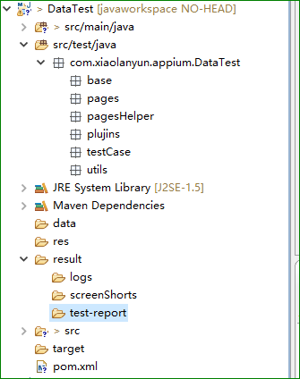
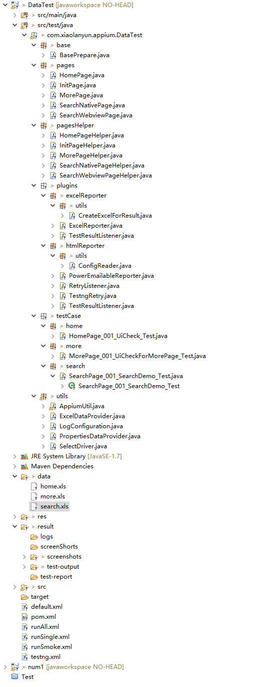

### 11.3、自动化测试框架

1、框架概览

包类文件类解释：

**base包：**

BasePerpare.java：启动和结束测试，以及数据提供者，提供测试数据,预处理

**pages包：**页面元素存放

**pagesHelper包：**

对该页面的操作方法存放，如点击，等待加载，验证文本内容，输入，清空等方法

**plugins包：**

excel和html插件

**testCase包：**

测试用例，调用Helper里面的各种方法进行操作

**utils包：**

**AppiumUtil.java:**

封装appium的api:

1、获取driver；

2、退出app；

3、退出移动浏览器；

4、通过By对象去查找某个元素；

5、通过By对象去查找一组元素；

6、清空元素内容；

7、输入内容；

8、点击；

9、查找一个元素，appium新增的查找元素方法；

10、查找一组元素，appium新增的查找元素方法；

11、获取文本1{getText(By by)}；

12、获取文本2{getText(String locateWay,String locateValue)}；

13、提交；

14、获得webview页面的标题；

15、获得元素属性的文本；

16、在给定的时间内找元素，如果没有找到则超时，抛出异常；

17、判断文本是不是和需求要求的文本一致；

18、暂停当前用力地执行，暂停的是件为：sleepTime；

19、根据元素来获取次元素的定位值；

20、判断实际文本时候包含期望文本；

21、跳转到webview页面（int index）；

22、跳转到webview页面（String contextName）;

23、执行javascript方法；

24、执行JavaScript方法和对象；

25、检查元素是不是存在；

26、长按操作；

27、滑动；

28、滚动，根据文本模糊匹配；

29、滚动，根据文本精准匹配；

30、拖拽操作；

31、 放大和缩小；

32、app置于后台运行；

33、收起键盘；

34、安装app；

35、app是否安装；

36、页面过长时候滑动页面window.scrollTo(左边距，上边距)；

37、后退

38、打开应用

**LogConfiguration.java:**

配置日志

**PropertiesDataProvide.java:**

从.properties文件中读取相关测试数据 

**SelectDriver.java:**

根据测试平台的不同生成不同的driver 比如AndroidDriver 或者是IOSDriver

**result文件夹：**

存放结果，包括excel和html结果

**xml文件：**

default.xml【书上自己建立的一个testng默认配置文件，要有】和testng.xml【这个是我自己生成的一个默认配置，不用管，没有也可以】

runAll.xml:测试多条用例顺序执行测试

runSingle.xml:测试单条用例执行测试

runSmoke.xml:冒烟测试

pom.xml:maven仓库管理依赖配置文件,以及要运行的testng.xml测试用例文件

【详细解释

**Base**

BasePrepare.java,这个类的主要作用是启动和关闭APP的作用，启动APP使用了TetsNG的@BeforeClass ，在@BeforeClass下会初始化APP并设置与APPIUM通信的相关数据。关闭APP使用了TestNG的@AfterClass，在这个注释下写了APP退出的操作；测试用例类中则是以@Test注释为主体的，在@Test注释下，书写了完整的测试步骤。测试用例继承这个BasePrepare.java

**pages**

页面元素类，每一个java类，都是一个页面，存放的都是对应页面的所有元素

**pageshelper**

存放的是对应页面的帮助类，这是什么意思？简单的说：在这个页面上做了什么操作都写在这个pageshelper中，如登录页面的方法

**plugins**

主要存放的是html报告插件和excel报告插件

**Testcases**

存放测试用例，有很多子包，子包的个数根据你测试的系统的模块来划分

**Utils**

封装了各种工具类，包括读取excel，appium api封装类，读取数据库类，读取属性文件类和生成driver的类等。

**其余文件说明，不一定要自己去建立**

**bin目录：**

项目编译生成class文件存放目录，这个目录不用去管，Eclipse会自动控制。

**config目录：**

存储框架类所需的所有属性文件，比如arrow的配置文件以及自定义的一些属性文件。

**result目录：**

存储测试框架运行测试用例生成的报告（包含log，截图等）

**src和target目录：**

可以不用管，由maven控制即可，整个框架，没有用到此目录，大家可以忽略。

接下来还剩几个xml文件，我们也来一一介绍一下：

**pom.xml：**

maven的配置文件，项目核心配置，用于构建项目、自动下载项目依赖以及后续的和testng、jenkins配合持续集成等

**runAll.xml：**

这是testng的配置文件，用于存放部分测试数据以及测试的平台，浏览器的配置、加入第三方插件监听（arrow插件）、设置用例执行策略（多线程还是单线程，顺序执行还是无序执行以及是否依赖执行等）以及设置要执行的用例。之所以改成runAll顾名思义就是说执行整个web项目的所有模块的用例的测试

**runSingle.xml**

和runAll.xml一样，不多解释，不一样的地方就是用它来做单个用例的调试改错，只涉及到单个的类（用例），所以调试改错专用。比如我用runAll.xml跑完了所有的用例，但是发现个别用例失败，此时先去分析log，如果是代码问题就去调试代码，调试完毕之后就去用runSingle.xml去跑一边此用例。

**default.xml:** 

只存储了测试参数（parameter）以及监听器（arrow），没有任何测试用例放在里面，这个xml文件是为了本框架的一个默认testng配置文件，主要是为了，直接在测试用例中右键运行测试用例，如果不配置一个默认的文件，直接在测试用例类中直接运行会跳过用例。因为xml文件中存储了一些必须的参数，比如测试浏览器是什么，测试平台是什么等等。框架搭建过程中会讲到如何设置default.xml文件。

**runSmoke.xml：**

这个主要执行冒烟测试用的，冒烟测试我们会先一些基本和核心功能作为测试重点，迅速跑一遍这些功能点，看看这个软件版本能不能released

】

2、框架快速上手

本地编写测试用例，首先需要配置好环境。

编写示例：以登陆界面为例

pages包下建立LoginPage.java，定义界面元素，格式参见框架源码相应文件。

***

pagesHelper包下建立LoginPageHelper.java,封装对登陆界面元素操作的方法，其操作函数调用的是Utils包下封装的appium函数，格式参见框架源码相应文件。

***

testCase包下建Login包，Login包下建立LoginPage_001_UICheckForLogin_Test.java，是测试用例，调用pagesHelper包下的LoginPageHelper.java中封装的操作方法，编写测试逻辑，格式参见框架源码相应文件。

命名规范：

1、操作页面，LoginPage，必须带有Page字段

2、用例编号，001，输出测试报告时进行读取，必须设置

3、测试用例描述，UICheckForLogin

4、文件作用，Test

***

在testng.xml中配置appium和手机相关参数，配置需要运行的测试用例，格式参见源码相应文件。

***

在pom.xml中配置需要运行的testng.xml文件，格式参见框架源码相应文件。

***

3、好处

在pagesHelper包下的界面操作方法封装使得编写测试用例时，测试逻辑容易编写，在长期项目中，封装的界面操作方法复用性极高，不同的组合即可形成新的测试逻辑。

