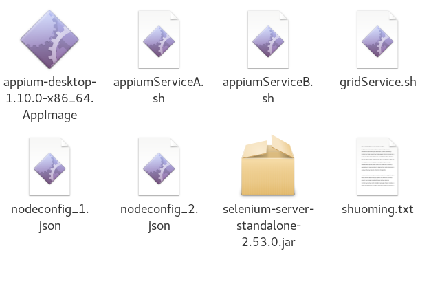

### 11.5、并行测试

1、对框架进一步改进，使其实现并行测试，由于物理机资源有限，暂时只进行两台安卓设备并行测试。

对BasePerpare.java进行修改，增加设备udid的获取与自动设置。

以selenium-server-standalone为支撑，由selenium-grid分配测试。

利用testng进行xml传参，设置测试用例执行机的udid，实现并行测试。

***

2、windos下并行测试bat脚本编写

运行顺序Grid-》appiumA,appiumB


2.1、启动AppiumGrid服务

```
@echo off

echo 正在启动Appium grid服务，请稍等。

echo 启动完毕之后，请不要关闭此窗口。

echo 当你看到"Selenium Grid hub is up and running"则表示启动成功。

java -jar selenium-server-standalone-2.53.0.jar -role hub -port 4444
```

2.2、启动AppiumServer[A]

```
@echo off

echo 启动appium server中，请不要关闭此窗口。

appium -a 127.0.0.1 -p 4723 -bp 4724   --selendroid-port 8090 --chrom edriver-port 9515 --session-override --nodeconfig nodeconfig_1.json
```


2.3、启动AppiumServer[B]

```
@echo off

echo 启动appium server中，请不要关闭此窗口。

appium -a 127.0.0.1 -p 4725 -bp 4726   --selendroid-port 8091 --chromedriver-port 9516 --session-override --nodeconfig nodeconfig_2.json
```


2.4、nodeconfig_1.json

```
{
	"capabilities":
	[
		{
		"browserName": "zuk",
		"version":"6.0.1",
		"maxInstances": 1,
		"platform":"WINDOWS"
		}
	],
	"configuration":
	{
		"cleanUpCycle":2000,
		"timeout":30000,
		"proxy": "org.openqa.grid.selenium.proxy.DefaultRemoteProxy",
		"url":"http://127.0.0.1:4723/wd/hub",
		"host": "127.0.0.1",
		"port": 4723,
		"maxSession": 1,
		"register": true,
		"registerCycle": 5000,
		"hubPort": 4444,
		"hubHost": "127.0.0.1"
	}
}
```


2.5、nodeconfig_2.json

```
{
	"capabilities":
	[
		{
		"browserName": "redmi",
		"version":"6.0.1",
		"maxInstances": 1,
		"platform":"WINDOWS"
		}
	],
	"configuration":
	{
		"cleanUpCycle":2000,
		"timeout":30000,
		"proxy": "org.openqa.grid.selenium.proxy.DefaultRemoteProxy",
		"url":"http://127.0.0.1:4725/wd/hub",
		"host": "127.0.0.1",
		"port": 4725,
		"maxSession": 1,
		"register": true,
		"registerCycle": 5000,
		"hubPort": 4444,
		"hubHost": "127.0.0.1"
	}
}
```


***

3、linux下shell脚本编写

其中nodeconfig_1.json和nodeconfig_2.json内容不变



3.1、appiumServiceA.sh

```
*#!/bin/bash*

echo 启动appium server中，请不要关闭此窗口。

./appium-desktop-1.10.0-x86_64.AppImage -a 127.0.0.1 -p 4723 -bp 4724   --selendroid-port 8090 --chrom edriver-port 9515 --session-override --nodeconfig nodeconfig_1.json
```


3.2、appiumServiceB.sh

```
*#!/bin/bash*

echo 启动appium server中，请不要关闭此窗口。

./appium-desktop-1.10.0-x86_64.AppImage -a 127.0.0.1 -p 4725 -bp 4726   --selendroid-port 8091 --chromedriver-port 9516 --session-override --nodeconfig nodeconfig_2.json
```


3.3、gridService.sh

```
*#!/bin/bash*

echo 正在启动Appium grid服务，请稍等。

echo 启动完毕之后，请不要关闭此窗口。

echo 当你看到"Selenium Grid hub is up and running"则表示启动成功。

java -jar selenium-server-standalone-2.53.0.jar -role hub -port 4444
```

3.4、shuoming.txt，方便复制开启服务

```
./gridService.sh
./appiumServiceA.sh
./appiumServiceB.sh
```

***

4、快速上手

4.1、开启服务配置

由于windos和centos都安装的是桌面版appium，所以配置参数部分都在appium中配置，即配置脚本中4723和4725两个appium服务，并设置，


图中直接设置了node配置为nodeconfig_1.json和nodeconfig_2.json是因为通过脚本打开时Appium面板时自动读取到脚本中nodeconfig设置，故不需配置路径。

运行时，先启动Grid脚本，再启动appiumA,appiumB两个脚本，然后会自动打开桌面版appium两个窗口，选择保存好的4723和4725两个appium服务依次启动。**必须是脚本启动面板，点击运行两个Appium服务才可以**

即可进行测试。

说明：设备名称在nodeconfig_1.json和nodeconfig_2.json中配置

```
"browserName": "zuk",

"browserName": "redmi"
```


***

设备udid获取

```
adb devices
```


设备的udid在testng.xml中需要运行的测试用例下配置，如

```
<test name="管理员界面切换" preserve-order="true">
		<parameter name="udid" value="113a20777d33"/> 
		<parameter name="deviceName" value="redmi"/>
		<packages>
			<package name="com.xiaolanyun.appium.DataTest.testCase.RootNavigation" />
		</packages>
	</test>
	<test name="管理员登陆添加买家卖家账户并购买商品发货" preserve-order="true">
		<parameter name="udid" value="63a7b810"/>
		<parameter name="deviceName" value="zuk"/>
		<packages>
			<package name="com.xiaolanyun.appium.DataTest.testCase.RootAddUserAndBuyGoods" />
		</packages>
	</test>
	
```

***

4.2、测试用例编写顺序，格式参照Appium测试框架。

***

4.3、增加测试设备

相应的按照格式增加nodeconfig配置文件，按照格式编写Appium启动脚本，增加Appium面版服务配置，进行testng.xml中的测试用例设备udid分配。

