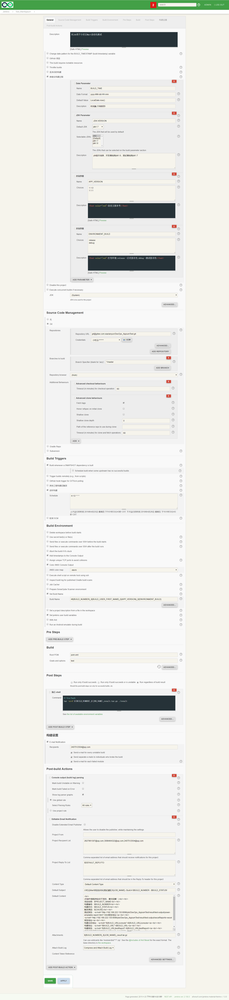

### 11.7、持续集成

1、Appium测试框架持续集成



shell脚本运行说明：

```
#!/bin/bash
tar -zcvf ${BUILD_NUMBER}_${JOB_NAME}_result.tar.gz ./result
```

***

2、并行测试框架持续集成


shell脚本说明：

```
#!/bin/bash
tar -zcvf ${BUILD_NUMBER}_${JOB_NAME}_result.tar.gz ./result
```


