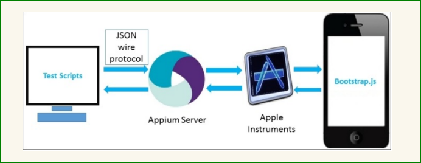
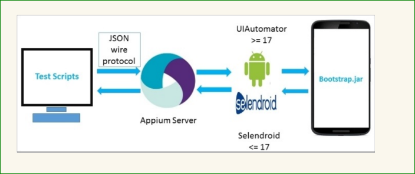

### 11、Appium_自动化测试框架

基于Appium设计开发测试框架，该框架提供详细的日志记录，异常截图，html测试报告，excel测试报告，执行多条测试用例，进一步改进实现多机器并行测试提高测试效率。

一、   软件简介

1、Appium哲学思想：

​	1.1、你无需为了自动化，而重新编译或者修改你的应用；

​	1.2、你不必局限于某种语言或者框架或者平台来书写和运行测试代码；

​	1.3、一个移动自动化的框架不应该在接口上重复造轮子。（移动自动化的接口应该统一）；

​	1.4、源代码必须开源

1.1ios图解

1.2Android图解

​                                

​	Cmd->appium 校验          版本  1.4.16.1

1.2、JDK

 	 为java测试语言提供运行环境支持和工具,推荐1.7

​       cmd->java或者javac或者java -version校验是否安装好

1.3、Eclipse

​       1.3.1、作为开发测试工具，testng、startexplorer插件必须下载

​	1.3.2在项目中会使用一款TestNG的扩展插件：htmlReporter，它是根据网易的一款开源项目改编而来。

​		它的功能主要有：

​		·收集详细的测试报告，包括截图和详细日志并以HTML形式展现

​		·失败的用例重新执行（需要配置）

​	1.3.3、还有Excel插件报告是基于testng研发的，直观显示项目的你测试项目的开始时间，结束时间，执行耗时，项目中测试用例总的成功率、失败率，以及各个模块中的用例的成功率，失败率。它还可以记录日志和截图。功能比Arrow强大，显示效果比Arrow也好

1.4、 Android SDK

​       Android开发工具包

​       Cmd->adb 校验是否安装成功

1.5、Maven

​       管理项目依赖，构建项目的工具,要3.3.9

​       Cmd->mvn 校验是否安装成功

1.6、Git

​       代码托管工具配合jenkins使用，进行代码的clone工作

1.7、Nodejs

​       Appium是使用nodejs实现的，node是解释器，版本6.11.3

1.8、Jenkins

​        持续集成构建集成工具，后期的项目持续集成测试，功能包括：

​	1.8.1、持续的软件版本发布/测试项目。

​	1.8.2、监控外部调用执行的工作。

​	1.8.3、在jenkins插件平台安装一个邮件插件（Email Extension Plugin），它可以帮助我们触发邮件系统，当你的测试运行完毕之后无论成功与否都会发送邮件给一些人

