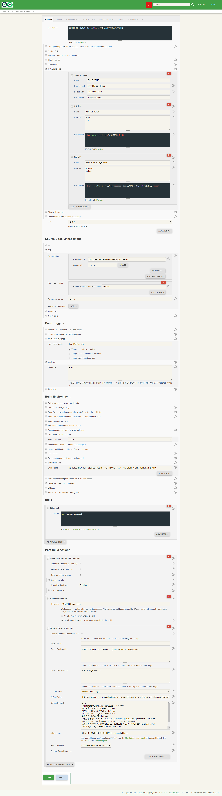

### 12.3、持续集成

持续集成以及shell脚本编写




monkey_shell.sh

```
#!/bin/bash
source /etc/profile
echo 正在创建截图保存文件夹
mkdir ./${BUILD_NUMBER}_${JOB_NAME}_result
echo 正在执行Maim_monkey
adb push framework.jar monkey.jar max.config /sdcard/01test
adb shell CLASSPATH=/sdcard/01test/monkey.jar:/sdcard/01test/framework.jar exec app_process /system/bin tv.panda.test.monkey.Monkey -p com.example.xiaolanyun.ldmart --uiautomatormix --running-minutes 2 -v -v --throttle 400 --output-directory /sdcard/01test/${BUILD_NUMBER}_${JOB_NAME}_screenshot
echo 执行完毕，正在将截图保存
adb pull /sdcard/01test/${BUILD_NUMBER}_${JOB_NAME}_screenshot ./${BUILD_NUMBER}_${JOB_NAME}_result
echo 正在打包截图
tar -zcvf ${BUILD_NUMBER}_${JOB_NAME}_screenshot.tar.gz ./${BUILD_NUMBER}_${JOB_NAME}_result
echo 打包已经完成，请您配合日志查看！
```


jenkins运行shell脚本

```
sh ./monkey_shell.sh
```


