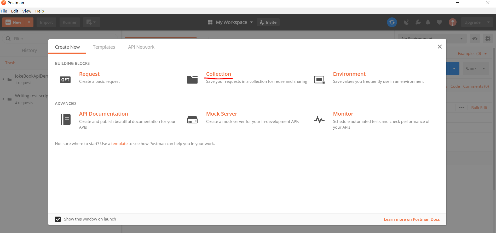
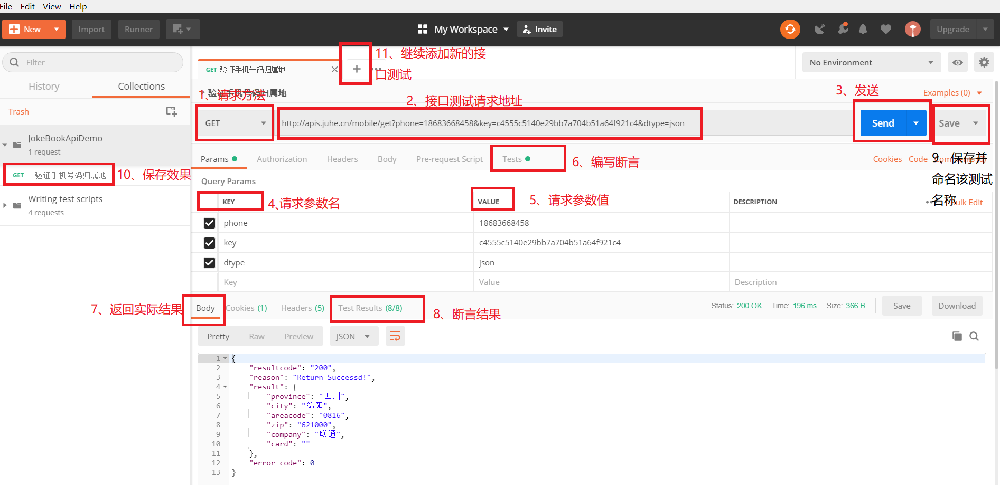
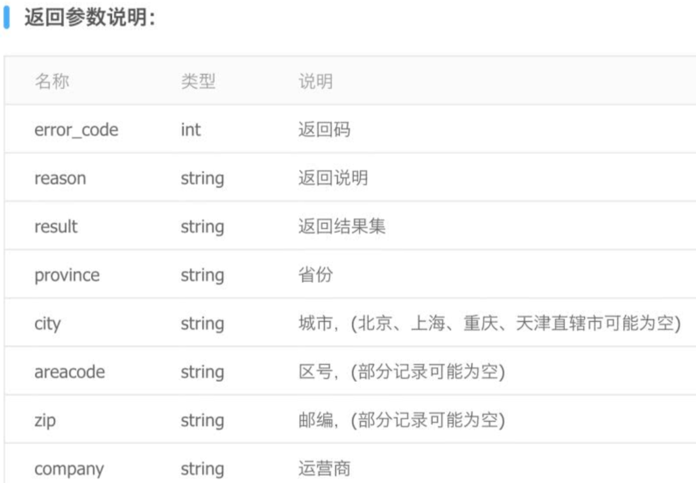
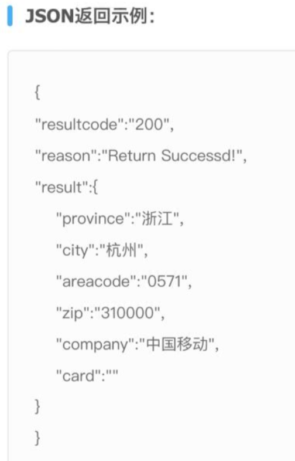
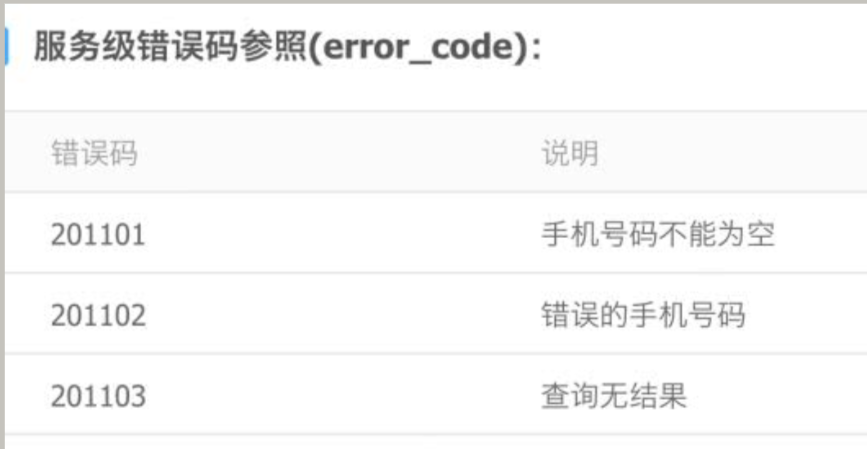
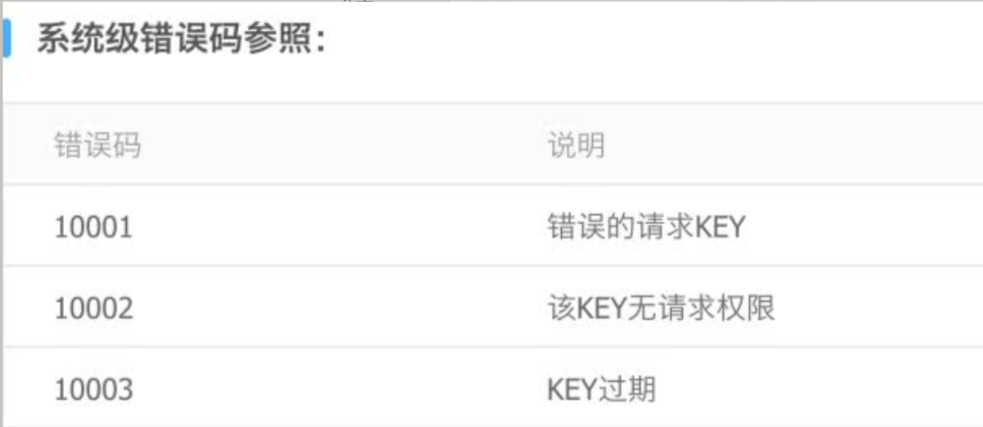
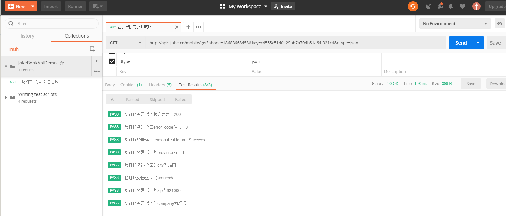
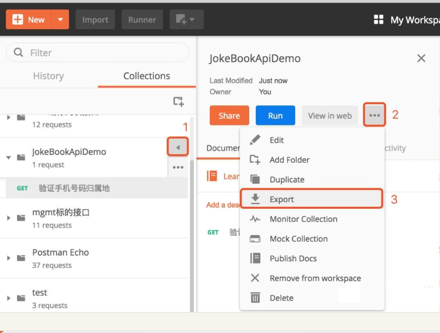

### 13.1、postman接口测试

1、下载并注册

[官网](https://www.getpostman.com/)

2、使用示例

创建测试集合管理测试用例,输入测试名称以及描述



接口测试过程



手机号码接口测试地址:http://apis.juhe.cn/mobile/get?phone=18683668458&key=c4555c5140e29bb7a704b51a64f921c4&dtype=json

接口说明：









断言判断以及详情:

```
//验证服务器返回状态码为200
pm.test(
    "验证服务器返回状态码为：200",function(){
        pm.response.to.have.status(200);
    }
    );
    //验证服务器返回error code值为0
pm.test("验证服务器返回error_code值为：0", function () {
    var jsonData = pm.response.json();
    pm.expect(jsonData.error_code).to.eql(0);
});
//验证服务器返回reason值为Return_Successd!
pm.test("验证服务器返回reason值为Return_Successd!", function () {
    var jsonData = pm.response.json();
    pm.expect(jsonData.reason).to.eql("Return Successd!");
});
//验证服务器返回的province为四川
pm.test("验证服务器返回的province为四川", function () {
    var jsonData = pm.response.json();
    var jsonDicData = jsonData.result;
    pm.expect(jsonDicData.province).to.eql("四川");
});
//验证服务器返回的city为绵阳
pm.test("验证服务器返回的city为绵阳", function () {
    var jsonData = pm.response.json();
    var jsonDicData = jsonData.result;
    pm.expect(jsonDicData.city).to.eql("绵阳");
});
//验证服务器返回的areacode为0816
pm.test("验证服务器返回的areacode", function () {
    var jsonData = pm.response.json();
    var jsonDicData = jsonData.result;
    pm.expect(jsonDicData.areacode).to.eql("0816");
});
//验证服务器返回的zip为621000
pm.test("验证服务器返回的zip为621000", function () {
    var jsonData = pm.response.json();
    var jsonDicData = jsonData.result;
    pm.expect(jsonDicData.zip).to.eql("621000");
});
//验证服务器返回的company为联通
pm.test("验证服务器返回的company为联通", function () {
    var jsonData = pm.response.json();
    var jsonDicData = jsonData.result;
    pm.expect(jsonDicData.company).to.eql("联通");
});
```


断言结果：



3、将Postman开发好的脚本导出，生成 *.json格式的文件




