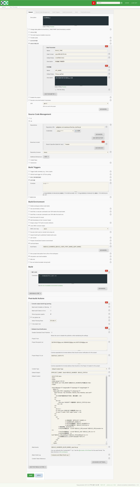

### 13.4、持续集成

jenkins建立自由风格job。



newmanApiTest_shell.sh

```
#!/bin/sh -l
source /etc/profile
cnpm install
echo 正在进行接口自动化........
newman run phonecheck.json -reporterscli,html,json --reporter-json-export poptestjsonOut.json --reporter-html-export poptesthtmlOut.html
echo 报告已经生成，正在打包......
tar -zcvf ${BUILD_NUMBER}_${JOB_NAME}_report.tar.gz ./newman
echo 请您查看邮件或者jenkins构建日志输出台！
```


jenkins中执行shell

```
sh ./newmanApiTest_shell.sh
```


