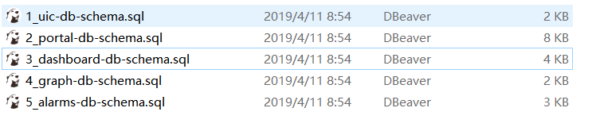

### 14.1、环境

1、redis【5.1节安装】

bigdata3 端口7111

bigdata2 端口7112

bigdata1 端口7113

***

2、数据库

sql建库建表文件共五个，导入生成数据库及表：

***

[数据库sql文件下载](https://github.com/open-falcon-archive/scripts)

***

3、open-falcon下载

[下载地址](https://github.com/open-falcon/falcon-plus/releases)

