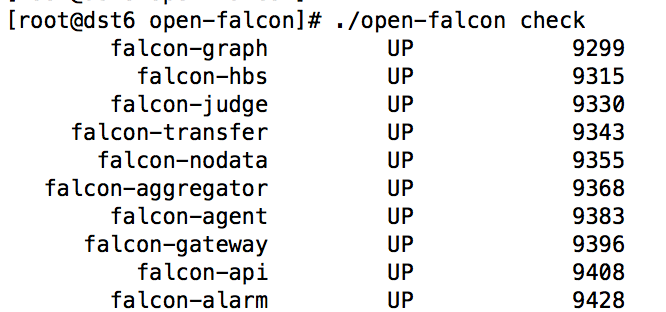
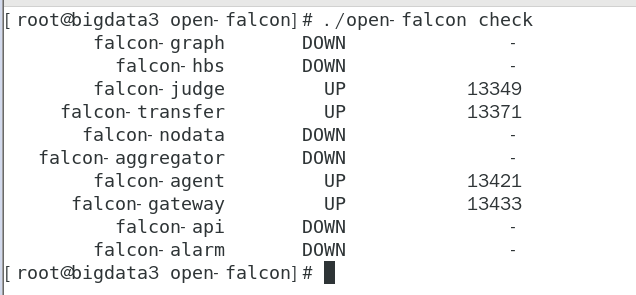

### 14.2、单机&分布式安装

说明：单机安装是分布式安装基础，分布式安装是为了减轻服务器压力。

agent:自发现，采集机器负载监控指标，与transfer建立长连接

transfer:数据转发服务，接收agent数据，传给graph和judage组件

graph：存储绘图数据，接收transfer，处理api查询，返回绘图数据

api：提供统一操作接口

hbs：心跳服务器，agent都会连接到hbs，更新host表，获取报警策略缓存在内存里，judage会请求。减少对DB压力。

judge:告警判断，transfer会将数据给judge判断是否告警【使用了redis，端口有变，请修改自己配制的redis，ip:端口，默认端口6379】

alarm：处理报警，从redis读取处理，包含发邮件，信息。

nodata：监测数据异常上报，和judge协同工作

aggregator：集群聚合，聚合集群下所有机器某个值，提供集群视角监控

gateway：和网络分区有关

***

1、单机安装【分布式安装基础准备】

一、       创建工作目录

```
export FALCON_HOME=/home/work

export WORKSPACE=$FALCON_HOME/open-falcon

mkdir -p $WORKSPACE
```


二、       解压二进制包

<https://github.com/open-falcon/falcon-plus/releases>

```
cd /data/program/software

`tar -xzvf open-falcon-v0.`2.1`.tar.gz -C `$WORKSPACE
```


三、       配置数据库账号和密码

```
cd $WORKSPACE

grep -Ilr 3306  ./ | xargs -n1 -- sed -i 's/root:/root:bigdata/g'

包含关键字                     s单行匹配   /g全局所有

注意root:后面默认密码为空，所以只是看到了root:

grep -Ilr 3306  ./ | xargs -n1 -- sed -i 's/root:/root:Admin123*/g'

修改数据库地址

grep -Ilr 3306 ./ | xargs -n1 -- sed -i 's/127.0.0.1/192.168.222.130/g'
```


四、       启动

查看目录下包括Open-Falcon的所有组件，先默认全部启动，之后一个一个进行分布式部署以及启动


```
cd $WORKSPACE

./open-falcon start
```


```
# 检查所有模块的启动状况

./open-falcon check
```



### *凡是DOWN开启失败的，自行查看该模块下日志排查问题*。

对于bigdata1,bigdata2自启动agent

```
vi /etc/rc.local

cd /home/work/open-falcon/ && sleep 10 && ./open-falcon start agent

保存,

chmod 775 /etc/rc.local        #每次修改rc.local后必须加该权限
```

***

对于bigdata3自启动open-falcon

```
vi /etc/rc.local

/home/work/open-falcon/dashboard/control
start
```

但是只自启动如下服务：



启动了judge,transfer,agent,gateway

没启动：alarm,api,aggregator,nodata,hbs,graph

在rc.local增加以下内容：

```
cd /home/work/open-falcon/ && sleep 10 && ./open-falcon start alarm

cd /home/work/open-falcon/ && sleep 10 && ./open-falcon start api

cd /home/work/open-falcon/ && sleep 10 && ./open-falcon start aggregator

cd /home/work/open-falcon/ && sleep 10 && ./open-falcon start nodata

cd /home/work/open-falcon/ && sleep 10 && ./open-falcon start hbs

cd /home/work/open-falcon/ && sleep 10 && ./open-falcon start graph

```


