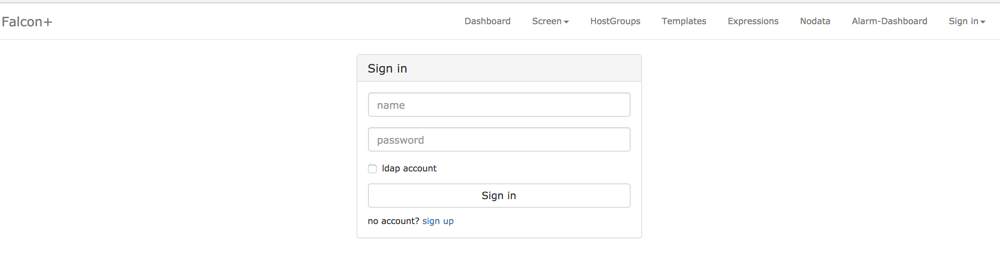

### 14.3、dashboard

dashboard为open-falcon前端面板。

***

一、       创建工作目录

这一步在创建后端服务的时候已经建立好，所以不需要再进行操作。

```
   export HOME=/home/work

   export WORKSPACE=$HOME/open-falcon

   mkdir -p $WORKSPACE

   cd $WORKSPACE
```

***

二、       克隆前端组件代码

```
cd $WORKSPACE

git clone https://github.com/open-falcon/dashboard.git
```

***

三、       安装依赖包

```
yum install -y python-virtualenv

yum install -y python-devel

yum install -y openldap-devel

yum install -y mysql-devel

yum groupinstall "Development tools"

 

cd $WORKSPACE/dashboard/

virtualenv ./env

 

./env/bin/pip install -r pip_requirements.txt -i https://pypi.douban.com/simple

注意：如果执行上面有问题，就直接执行./env/bin/pip install -r pip_requirements.txt
```

***

问题：msrest 0.4.25安装失败，需要certifi,它没安装，msrestazure 0.4.21 需要keytring>=5.6,但是本机是5.0，无法卸载requests，它是某个一部分，只会卸载一部分

解决：

```
pip install -i https://pypi.tuna.tsinghua.edu.cn/simple msrest

pip install -i https://pypi.tuna.tsinghua.edu.cn/simple certifi

pip install -i https://pypi.tuna.tsinghua.edu.cn/simple --upgrade keyring

yum install -y python-virtualenv mysql-community-delvel    # run as root

cd /opt/openfalcon/dashboard/
virtualenv ./env

./env/bin/pip install -r pip_requirements.txt
```


***

四、       修改配置

dashboard的配置文件为： 'rrd/config.py'，请根据实际情况修改

```
## API_ADDR 表示后端api组件的地址

API_ADDR = "http://127.0.0.1:8080/api/v1" 

## 根据实际情况，修改PORTAL_DB_*, 默认用户名为root，默认密码为""

## 根据实际情况，修改ALARM_DB_*, 默认用户名为root，默认密码为""
```


***

五、       启动

```
bash control start

open http://127.0.0.1:8081 in your browser.

停止

bash control stop
```


