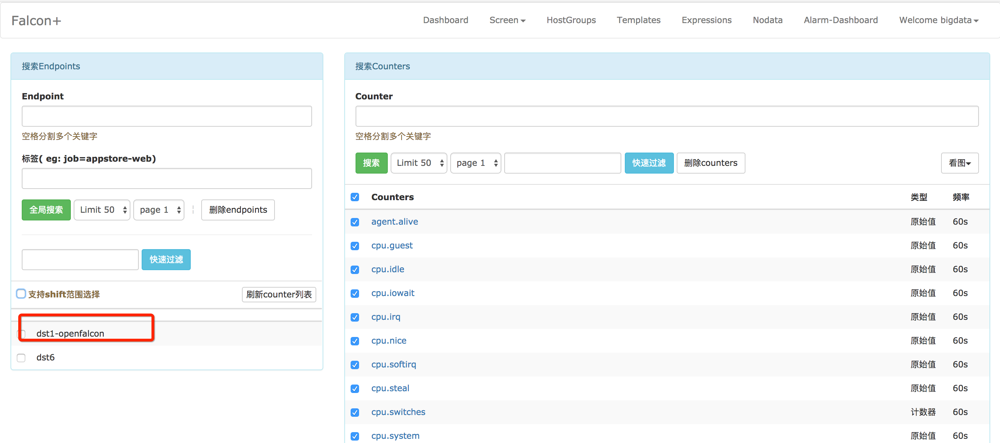

### 14.4、Agent

1、agent用于采集机器负载监控指标，比如cpu.idle、load.1min、disk.io.util等等，每隔60秒push给Transfer。agent与Transfer建立了长连接，数据发送速度比较快，agent提供了一个http接口/v1/push用于接收用户手工push的一些数据，然后通过长连接迅速转发给Transfer。

***

2、agent需要部署到所有要被监控的机器上，比如公司有10万台机器，那就要部署10万个agent。agent本身资源消耗很少，不用担心。

首先找到之前后端服务的解压目录：

/home/work/open-falcon/

拷贝agent到需要监控的服务器上面

```
scp -r agent/ root@dst1:/home/work/open-falcon
```

拷贝open-falcon到需要监控的服务器上面

```
scp -r open-falcon root@dst1:/home/work/open-falcon
```

修改配置文件：

配置文件必须叫cfg.json，如下参照修改：

```
{

    "debug": true,  # 控制一些debug信息的输出，生产环境通常设置为false

    "hostname": "", # agent采集了数据发给transfer，endpoint就设置为了hostname，默认通过`hostname`获取，如果配置中配置了hostname，就用配置中的

    "ip": "", # agent与hbs心跳的时候会把自己的ip地址发给hbs，agent会自动探测本机ip，如果不想让agent自动探测，可以手工修改该配置

    "plugin": {

        "enabled": false, # 默认不开启插件机制

        "dir": "./plugin",  # 把放置插件脚本的git repo clone到这个目录

        "git": "https://github.com/open-falcon/plugin.git", # 放置插件脚本的git repo地址

        "logs": "./logs" # 插件执行的log，如果插件执行有问题，可以去这个目录看log

    },

    "heartbeat": {

        "enabled": true,  # 此处enabled要设置为true

        "addr": "127.0.0.1:6030", # hbs的地址，端口是hbs的rpc端口

        "interval": 60, # 心跳周期，单位是秒

        "timeout": 1000 # 连接hbs的超时时间，单位是毫秒

    },

    "transfer": {

        "enabled": true, 

        "addrs": [

            "127.0.0.1:18433"

        ],  # transfer的地址，端口是transfer的rpc端口, 可以支持写多个transfer的地址，agent会保证HA

        "interval": 60, # 采集周期，单位是秒，即agent一分钟采集一次数据发给transfer

        "timeout": 1000 # 连接transfer的超时时间，单位是毫秒

    },

    "http": {

        "enabled": true,  # 是否要监听http端口

        "listen": ":1988",

        "backdoor": false

    },

    "collector": {

        "ifacePrefix": ["eth", "em"], # 默认配置只会采集网卡名称前缀是eth、em的网卡流量，配置为空就会采集所有的，lo的也会采集。可以从/proc/net/dev看到各个网卡的流量信息

        "mountPoint": []

    },

    "default_tags": {

    },

    "ignore": {  # 默认采集了200多个metric，可以通过ignore设置为不采集

        "cpu.busy": true,

        "df.bytes.free": true,

        "df.bytes.total": true,

        "df.bytes.used": true,

        "df.bytes.used.percent": true,

        "df.inodes.total": true,

        "df.inodes.free": true,

        "df.inodes.used": true,

        "df.inodes.used.percent": true,

        "mem.memtotal": true,

        "mem.memused": true,

        "mem.memused.percent": true,

        "mem.memfree": true,

        "mem.swaptotal": true,

        "mem.swapused": true,

        "mem.swapfree": true

    }

}
```

***

3、启动

```
./open-falcon start agent  启动进程

./open-falcon stop agent  停止进程

./open-falcon monitor agent  查看日志
```


看var目录下的log是否正常，或者浏览器访问其1988端口。另外agent提供了一个--check参数，可以检查agent是否可以正常跑在当前机器上

/home/work/open-falcon/agent/bin下

```
./falcon-agent --check
```

进入监控界面查看：

