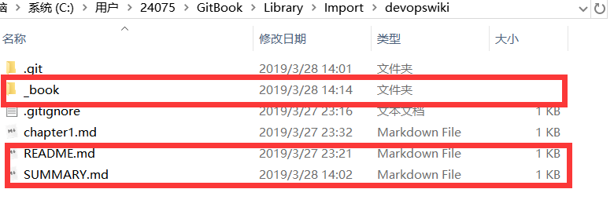

### 15.1、wiki搭建使用

1、安装node.js

升级npm

```
npm install -g npm
```

安装gitbook

```
npm install gitbook-cli -g
```

初始化【请选择一个存放wiki文档的文件夹】

```
gitbook init
```

文件夹里生成



gitbook init 初始化书籍目录

README.md【对书籍的简单介绍】和SUMMARY.md【书籍目录结构】是两个必须文件

gitbook serve    编译和预览书籍，会自动调用gitbook build编译书籍，完成以后会打开一个web服务器，监听本地的4000端口

http://localhost:4000/

SUMMARY.md管理目录：请将以下的中文字符替换成英文字符

【章节名称】（对应的文件名称）.md

空格空格-空格【子章节名称】（对应的文件名称md）      

【章节名称】（对应的文件名称.md）

然后建立相应的文件即可

***

2、配置插件

Gitbook默认自带有5个插件：

·        highlight： 代码高亮

·        search： 导航栏查询功能（不支持中文）

·        sharing：右上角分享功能

·        font-settings：字体设置（最上方的"A"符号）

·        livereload：为GitBook实时重新加载

 

目录下建立book.js

```
{

  "plugins": [

    "github-buttons",//右上角添加github图标

    "donate",//打赏

    "edit-link",//每个页面上添加了“编辑此页面”链接。

链接目标将是Github或Gitlab上的该页面的源文件或任何repo

 

    "back-to-top-button",//回到顶部

    "chapter-fold",//支持多层目录，点击导航栏的标题名就可以实现折叠扩展

    "expandable-chapters-small",//左侧章节目录可折叠，只有点击箭头才能实现折叠扩展

    "insert-logo",//左上角显示logo

    "splitter",//侧边栏宽度可调节

    "pageview-count",//阅读量计数

"popup",//单击图片，在新页面查看大图

"github",

"-sharing", 

"sharing-plus"

  ],

  "pluginsConfig": {

           "github-buttons": {

             "buttons": [{

               "user": "xiaolanyun",

               "repo": "DevOps_wiki",

               "type": "star",

               "size": "large"

             }, {

               "user": "xiaolanyun",

               "type": "follow",

               "width": "230",

               "count": false

             }]

           },

           "donate": {

                 "wechat": "D:/wiki/devopswiki/images/weixin.png",

                 "alipay": "D:/wiki/devopswiki/images/zhifubao.png",

                 "title": "默认空",

                 "button": "默认值：Donate",

                 "alipayText": "默认值：支付宝捐赠",

                 "wechatText": "默认值：微信捐赠"

               },

  

             "edit-link": {

                           "base": "https://github.com/USER/REPO/edit/BRANCH/path/to/book",

                           "label": {

                               "en": "Edit This Page",

                               "de": "Seite bearbeiten"

                           }

                },

             

             "insert-logo": {

                 "url": "http://server.zzidc.com/uploads/allimg/171120/1-1G120162T3202.png",

                 "style": "background: none; max-height: 30px; min-height: 30px"

               },

 

           "github": {

            "url": "https://github.com/xiaolanyun/DevOps_wiki/"

        },

       

           "sharing": {

           "douban": false,

           "facebook": false,

           "google": true,

           "hatenaBookmark": false,

           "instapaper": false,

           "line": true,

           "linkedin": true,

           "messenger": false,

           "pocket": false,

           "qq": false,

           "qzone": true,

           "stumbleupon": false,

           "twitter": false,

           "viber": false,

           "vk": false,

           "weibo": true,

           "whatsapp": false,

           "all": [

               "douban", "facebook", "google", "hatenaBookmark", 

               "instapaper", "linkedin","twitter", "weibo", 

               "messenger","qq", "qzone","viber","vk","weibo",

               "pocket", "stumbleupon","whatsapp"

           ]

	} 

  }

}
```


***

3、关联github

```
gitbook server

wiki文件夹下编译书籍之后会在_book下生成html

github建立仓库。

本地执行git命令

git init

git add .

git commit -m “提交文件”

git remote add origin 远程仓库链接

git push -u origin master

所有文件提交到github主干master上，接下来将_book生成的html提交到分支gh-pages上.【gh-pages名称固定，不可改变】

git checkout -b 'gh-pages'    //创建并切换

首先桌面建立一个文件夹A，将除了.git文件夹外其余文件全部拷贝出来，然后将wiki文件夹里除了.git外删除。

打开A，将_book文件夹下的文件拷贝到wiki下。

git add .

git commit -m "提交页面"

git push origin gh-pages
```


提交分支成功后github进行设置即可访问

***

此时想切换回master分支操作

删除在wiki文件夹下的刚才粘贴的那些文件，只留下.git文件夹

将刚才备份在A的所有文件再拷贝回来

此时git checkout master切换会提示以下文件都没有被跟踪

```
git add .

git checkout master//这样就切换回来了

git pull origin master//例行拉取更新，避免冲突

```


