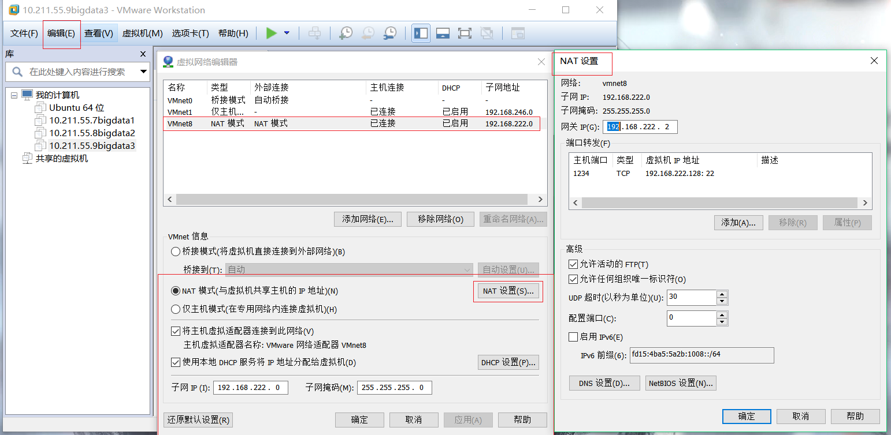
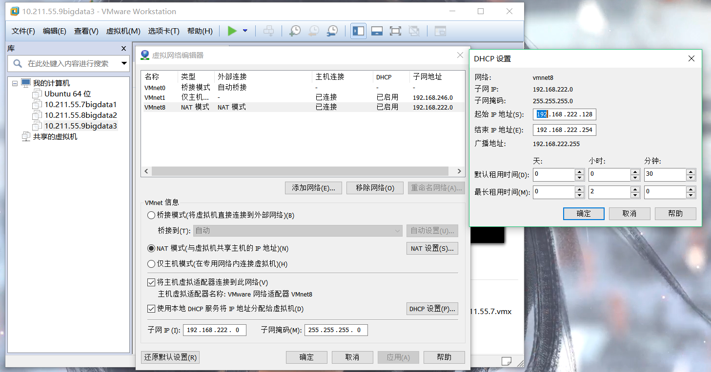
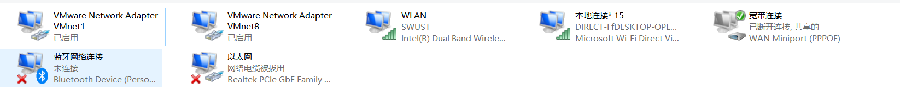
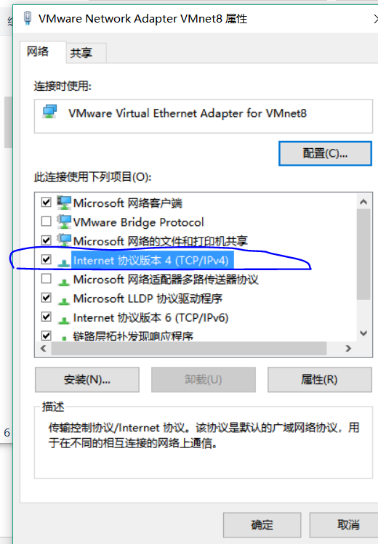
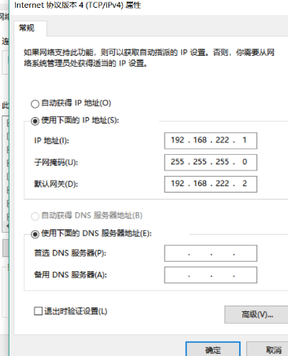

### 2.1、配置静态IP

------

首先记录vm的网络相关设置

1、查看VMnet8设置[不需要改动]:





VMnet8中底部参数：

子网ip:192.168.222.0

子网掩码：255.255.255.0

NAT设置

子网ip：192.168.222.0

子网掩码：255.255.255.0

网关ip：192.168.222.2

DHCP设置

子网ip:192.168.222.0

子网掩码：255.255.255.0

起始ip地址：192.168.222.128

结束ip地址：192.168.222.254

***

2、打开windows网络设置，选择更改适配器，选择适配器VMware Network Adapter VMnet8，右键属性，双击打开ipv4。







选择使用下面的ip地址

ip地址：192.168.222.1

子网掩码和虚拟机一样。

默认网关和虚拟机一样。

***

3、bigdata1终端编辑网卡:

使用goole免费的DNS服务,每个虚拟机都需要进行配置dns，否则无法上网。

***

```
vi /etc/resolv.conf

\# Generated by NetworkManager

nameserver 8.8.8.8

nameserver 8.8.4.4
```

***

查看mac地址

```
ip addr

2: ens33: mtu 1500 qdisc pfifo_fast state UP group default qlen 1000

 link/ether 00:0c:29:b9:5f:c2 brd ff:ff:ff:ff:ff:ff

 inet 192.168.222.128/24 brd 192.168.222.255 scope global noprefixroute dynamic ens33

 valid_lft 1720sec preferred_lft 1720sec
```

***

```
vi /etc/sysconfig/network-scripts/ifcfg-ens33

TYPE=Ethernet

PROXY_METHOD=none

BROWSER_ONLY=no

BOOTPROTO=static

DEFROUTE=yes

IPV4_FAILURE_FATAL=no

IPV6INIT=yes

IPV6_AUTOCONF=yes

IPV6_DEFROUTE=yes

IPV6_FAILURE_FATAL=no

IPV6_ADDR_GEN_MODE=stable-privacy

NAME=ens33

UUID=60ffed6f-eb08-4ced-8483-f2ca3a5def93

DEVICE=ens33

ONBOOT=yes

IPADDR=192.168.222.8【设置自己想要的ip】

NETMASK=255.255.255.0【设置网关，和vm配置一样】

GATEWAY=192.168.222.2【设置子网掩码】

HWADDR=00:0c:29:b9:5f:c2【设置mac地址】
```

***

4、重启网卡

```
service network restart
```

***

5、同理查看并设置bigdata2,bigdata3的dn，ip，网关，子网掩码，mac地址。

```
bigdata2:

00:0c:29:3b:d7:04

bigdata3:

00:0c:29:a9:9a:99
```