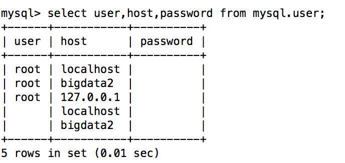

### 3.2、mysql5.7&8.0设置用户密码

1、临时密码登录

注意：mysql5.7开始废弃了user表中的password字段和 password() 方法，用authentication_string代替password。所以凡是利用password和password()修改密码的都不正确。

在bigdata2,bigdata3分别查看临时密码

```
cat /var/log/mysqld.log

grep “password” /var/log/mysqld.log

------
A temporary password is generated for root@localhost: &o30myC(fkq<
------


```

注意：mysql8.0以上密码策略限制必须要大小字母写加数字特殊符号

```
alter user 'root'@'localhost' identified by 'Admin123*';【执行该语句需要将配置参数skip-grant-tables去掉，并且重启mysql服务，以临时密码登陆】
```

2、设置用户密码

查看mysql用户和密码

```
select user,host,password from mysql.user;
```



发现查询密码都是空，然后开始设置root的密码为Admin123*

```
mysql> set authentication_string for root@localhost = authentication_string('Admin123*');

或者

mysql>ALTER USER 'root'@'localhost' IDENTIFIED BY '新密码(必须包含：数字大小写字母特殊字符)'; 

退出：mysql>exit
```

1、 用新密码登录

```
mysql –u root –p
```

