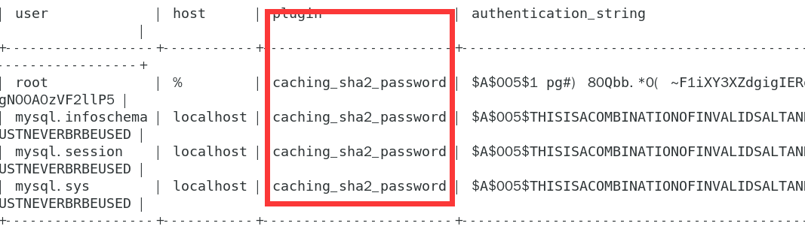

### 3.4、mysql8.0驱动

1、部分软件连接MySQL 8.0显示"Unable to load authentication plugin'caching_sha2_password'."

解决：

My SQL 8.0.4开始默认使用新的认证插件"caching_sha2_password"，而很多软件还在使用原来的"mysql_native_password"插件。于是修改my.cnf文件，设置默认使用mysql_native_password：

```
vi /etc/my.cnf

default_authentication_plugin=mysql_native_password
```

输入   use mysql   和 select user,host,plugin,authentication_string from user;

可以看到如下的界面，即用户的密码加密规则



进行规则修改

```
mysql> ALTER USER 'root'@'%' IDENTIFIED WITH mysql_native_password BY 'Admin123*';
执行失败报错

ERROR 3009 (HY000): Column count of mysql.user is wrong. Expected 45, found 43. Created with MySQL 5
```

解决：使用mysql_upgrade命令

***

```
mysql_upgrade -u root -p

再次执行

ALTER USER 'root'@'%' IDENTIFIED WITH mysql_native_password BY 'Admin123*';

mysql> FLUSH PRIVILEGES;

输入   use mysql   和 select user,host,plugin,authentication_string from user;

验证是否生效。
```


