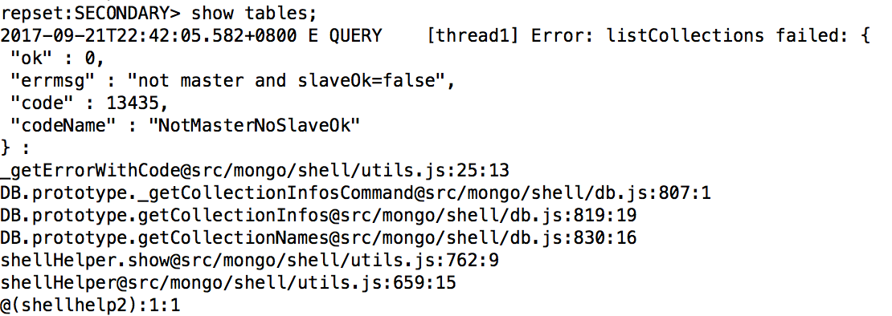

### 4.2、集群测试

1、退出上面的mongodb，重新连接。

在bin目录下

```
./mongo
```

主节点连接到终端：

```
mongo 127.0.0.1
```

连接test数据库：

```
use test；
```

往testdb表里插入数据

```
db.testdb.insert({"test1":"testval1"})
```

在副本节点连接查询：

```
./mongo 10.211.55.7:27107

使用test数据库：use test;

查询表格：show tables;
```

报错如下：



mongodb默认是从主节点读写数据，副本节点上不允许读，设置副本节点可读。

```
db.getMongo().setSlaveOk();

然后就可以查询复制过来的数据了

repset:SECONDARY> db.testdb.find();

{ "_id" : ObjectId("59c3cf8bf21850357d5392ba"), "test1" : "testval1" }
```

***

测试集群恢复功能，去停掉主节点：

然后查看节点状态，发现7和8中有一台变为了PRIMARY，然后再启动主节点观察状态

***

问题：查询错误

```
show dbs

2018-11-26T10:58:46.902+0800 E QUERY    [thread1] Error: listDatabases failed:{

       "ok" : 0,

       "errmsg" : "not master and slaveOk=false",

       "code" : 13435,

       "codeName" : "NotMasterNoSlaveOk"

} :

_getErrorWithCode@src/mongo/shell/utils.js:25:13

Mongo.prototype.getDBs@src/mongo/shell/mongo.js:62:1

shellHelper.show@src/mongo/shell/utils.js:769:19

shellHelper@src/mongo/shell/utils.js:659:15

@(shellhelp2):1:1
```

解决：

```
> rs.slaveOk()

> show dbs

local  0.000GB
```

