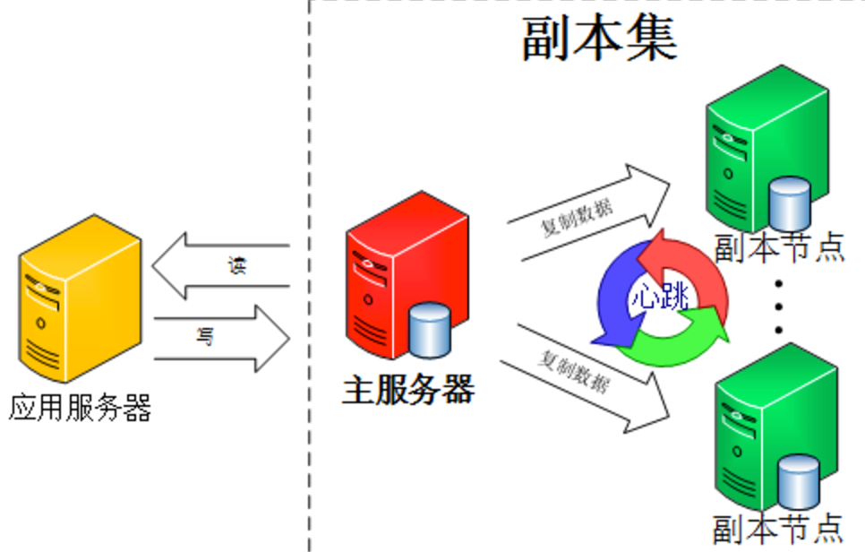
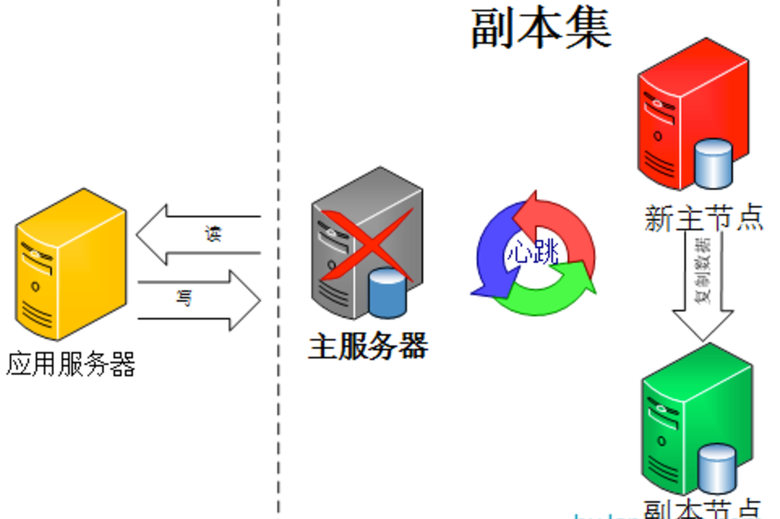

### 4、mongodb

1、架构介绍

 mongodb有几种部署方式，这里采用的是副本集架构（Replica Set）。

为了防止单点故障就需要引副本（Replication），当发生硬件故障或者其它原因造成的宕机时，可以使用副本进行恢复，最好能够自动的故障转移（failover）。有时引入副本是为了读写分离，将读的请求分流到副本上，减轻主（Primary）的读压力。而Mongodb的Replica Set都能满足这些要求。

 Replica Set是一堆mongod的实例集合，它们有着同样的数据内容。包含三类角色：

主节点（Primary）：接收所有的写请求，然后把修改同步到所有Secondary。一个Replica Set只能有一个Primary节点，当Primary挂掉后，其他Secondary或者Arbiter节点会重新选举出来一个主节点。默认读请求也是发到Primary节点处理的，需要转发到Secondary需要客户端修改一下连接配置。

 副本节点（Secondary）：与主节点保持同样的数据集。当主节点挂掉的时候，参与选主。

 仲裁者（Arbiter）：不保有数据，不参与选主，只进行选主投票。使用Arbiter可以减轻数据存储的硬件需求，Arbiter跑起来几乎没什么大的硬件资源需求，但重要的一点是，在生产环境下它和其他数据节点不要部署在同一台机器上。

注意，一个自动failover的Replica Set节点数必须为奇数，目的是选主投票的时候要有一个大多数才能进行选主决策。

 

由图可以看到客户端连接到整个副本集，不关心具体哪一台机器是否挂掉。主服务器负责整个副本集的读写，副本集定期同步数据备份，一但主节点挂掉，副本节点就会选举一个新的主服务器，这一切对于应用服务器不需要关心。我们看一下主服务器挂掉后的架构：

 

副本集中的副本节点在主节点挂掉后通过心跳机制检测到后，就会在集群内发起主节点的选举机制，自动选举一位新的主服务器。