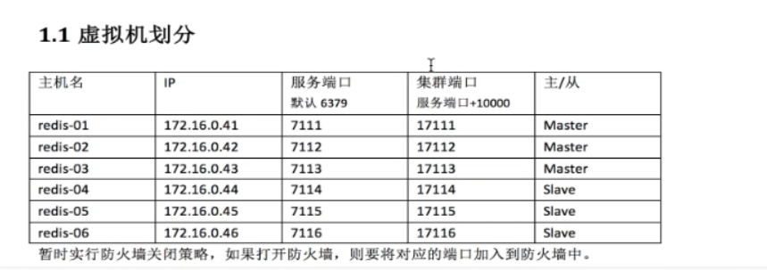

### 5.1安装部署

1、环境准备，安装常用软件，免去后续麻烦

```
yum -y install gcc gcc-c++ autoconf libjpeg libjpeg-devel libpng libpng-devel freetype freetype-devel libxml2 libxml2-devel zlib zlib-devel glibc glibc-devel glib2 glib2-devel bzip2 bzip2-devel zip unzip ncurses ncurses-devel curl curl-devel e2fsprogs e2fsprogs-devel krb5-devel libidn libidn-devel openssl openssh openssl-devel libxslt-devel libevent-devel ntp  libtool-ltdl bison libtool vim-enhanced python wget lsof iptraf strace lrzsz kernel-devel kernel-headers pam-devel Tcl/Tk  cmake  ncurses-devel bison setuptool popt-devel net-snmp screen perl-devel pcre-devel net-snmp screen tcpdump rsync sysstat man iptables sudo idconfig git system-config-network-tui bind-utils update arpscan tmux elinks numactl iftop  bwm-ng
```

```
yum install tcl
```

***

安装pip

```
wget https://bootstrap.pypa.io/get-pip.py> --no-check-certificate

python get-pip.py

#使用国内豆瓣源

mkdir /root/.pip

vi /root/.pip/pip.conf

[global]

index-url = http://pypi.douban.com/simple

trusted-host = pypi.douban.com
```

***

```
yum install golang

#检查版本

go version
```

***

2、安装

[redis下载](http://download.redis.io/releases/)

将下载的包复制到bigdata3

```
tar -zxvf redis-3.0.3.tar.gz -C /usr/local

进入目录/usr/local/redis-3.0.3使用PREFIX指定安装目录并安装 

make PREFIX=/usr/local/redis-3.0.3 install

安装以后可以看到/usr/local/redis-3.0.3目录下有一个bin目录，bin目录里面就是redis命令脚本：

redis-benchmark   redis-check-aof  redis-check-dump  redis-server
```


***

3、配置

3.1、虚拟机划分【本来集群是需要6台机器，但是硬件条件有限，只配置三台主节点】



3.2、配置文件

先编辑三个机器配置文件

```
vi /usr/local/redis-3.0.3/redis.conf

daemonize yes

pidfile  /var/run/redis-7111.pid   /var/run/redis-7112.pid   /var/run/redis-7113.pid 

port  7111   7112   7113

databases   1

cluster-enabled  yes

cluster-config-file  /usr/local/redis-3.0.3/cluster/7111/nodes.conf 

/usr/local/redis-3.0.3/cluster/7112/nodes.conf

/usr/local/redis-3.0.3/cluster/7113/nodes.conf

cluster-node-timeout  15000

cluster-migration-barrier  1

cluster-require-full-coverage    yes

appendonly   yes
```

参数解释：


然后如下创建文件夹并复制文件

由于物理机资源紧张，暂时不配置从节点，只有三个主节点

```
bigdata3  192.168.222.130

mkdir -p /usr/local/redis-3.0.3/cluster/7111

cp /usr/local/redis-3.0.3/redis.conf /usr/local/redis-3.0.3/cluster/7111/redis-7111.conf

 

bigdata2   192.168.222.129

mkdir -p /usr/local/redis-3.0.3/cluster/7112

cp /usr/local/redis-3.0.3/redis.conf /usr/local/redis-3.0.3/cluster/7112/redis-7112.conf

 

bigdata1  192.168.222.128

mkdir -p /usr/local/redis-3.0.3/cluster/7113

cp /usr/local/redis-3.0.3/redis.conf /usr/local/redis-3.0.3/cluster/7113/redis-7113.conf


启动

bigdata3

/usr/local/redis-3.0.3/bin/redis-server /usr/local/redis-3.0.3/cluster/7111/redis-7111.conf

 

bigdata2

/usr/local/redis-3.0.3/bin/redis-server /usr/local/redis-3.0.3/cluster/7112/redis-7112.conf

 

bigdata1

/usr/local/redis-3.0.3/bin/redis-server /usr/local/redis-3.0.3/cluster/7113/redis-7113.conf

------

启动之后用ps命令分别查看实例启动情况

ps -ef|grep redis
```

***

4、配置集群

安装ruby和rubygems（注意：需要ruby>1.8.7）

不要直接yum install ruby，只会安装2.0.0，但是2.0.0版本依旧太低

安装yum源

```
yum install centos-release-scl-rh

yum install rh-ruby24 -y

后面是4是需要安装的版本号

scl enable rh-ruby24 bash

查看ruby版本

ruby -v

 

yum install rubygems

 

Gem安装redis ruby接口

gem install redis
```

【以上三台机子都要安装】

执行redis集群创建命令（只需要在其中一个节点执行一次即可）

```
cp /usr/local/redis-3.0.3/src/redis-trib.rb /usr/local/bin/redis-trib
```

 注意：Redis群集至少需要3个主节点。*每个节点有3个节点和1个副本，即至少需要6个节点，但是物理机资源不足，只创建三个主节点，放弃从节点。

```
redis-trib create --replicas 0 192.168.222.130:7111 192.168.222.129:7112 192.168.222.128:7113
```

（1）给定的redis-trip 程序的命令是create，这表示我们希望创建一个新的集群

（2）这里的—replicas 1表示每个主节点下有一个从节点

（3）之后跟着其他参数则是实例的地址列表，程序使用这些地址所知识的实例来创建新集群

总的来说，以上命令意思就是让redis-trib程序创建一个包含三个主节点集群

接着，redis-trip会打印出一份预想中的配置给你看，你觉得没问题的话，就输入yes，redis-trip就会将这份配置应用到集群当中

如下：

```
>>> Creating cluster

Connecting to node 192.168.222.130:7111: OK

Connecting to node 192.168.222.129:7112: OK

Connecting to node 192.168.222.128:7113: OK

>>> Performing hash slots allocation on 3 nodes...

Using 3 masters:

192.168.222.130:7111

192.168.222.129:7112

192.168.222.128:7113

M: 227a92f42f29d967f535e9edf88f775aa0e27a07 192.168.222.130:7111

   slots:0-5460 (5461 slots) master

M: 1794d406517c36985617ac129e11b144a4227a7d 192.168.222.129:7112

   slots:5461-10922 (5462 slots) master

M: ee87b8c8145053cc4aa5969cd31c72c37e413f8f 192.168.222.128:7113

   slots:10923-16383 (5461 slots) master

Can I set the above configuration? (type 'yes' to accept): yes

>>> Nodes configuration updated

>>> Assign a different config epoch to each node

>>> Sending CLUSTER MEET messages to join the cluster

Waiting for the cluster to join.

>>> Performing Cluster Check (using node 192.168.222.130:7111)

M: 227a92f42f29d967f535e9edf88f775aa0e27a07 192.168.222.130:7111

   slots:0-5460 (5461 slots) master

M: 1794d406517c36985617ac129e11b144a4227a7d 192.168.222.129:7112

   slots:5461-10922 (5462 slots) master

M: ee87b8c8145053cc4aa5969cd31c72c37e413f8f 192.168.222.128:7113

   slots:10923-16383 (5461 slots) master

[OK] All nodes agree about slots configuration.

>>> Check for open slots...

>>> Check slots coverage...

[OK] All 16384 slots covered.


```


