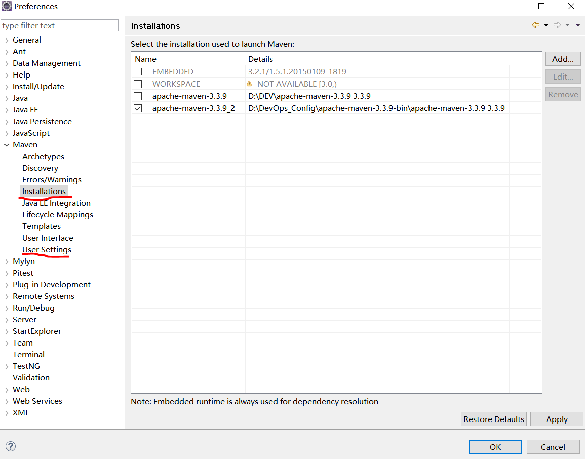
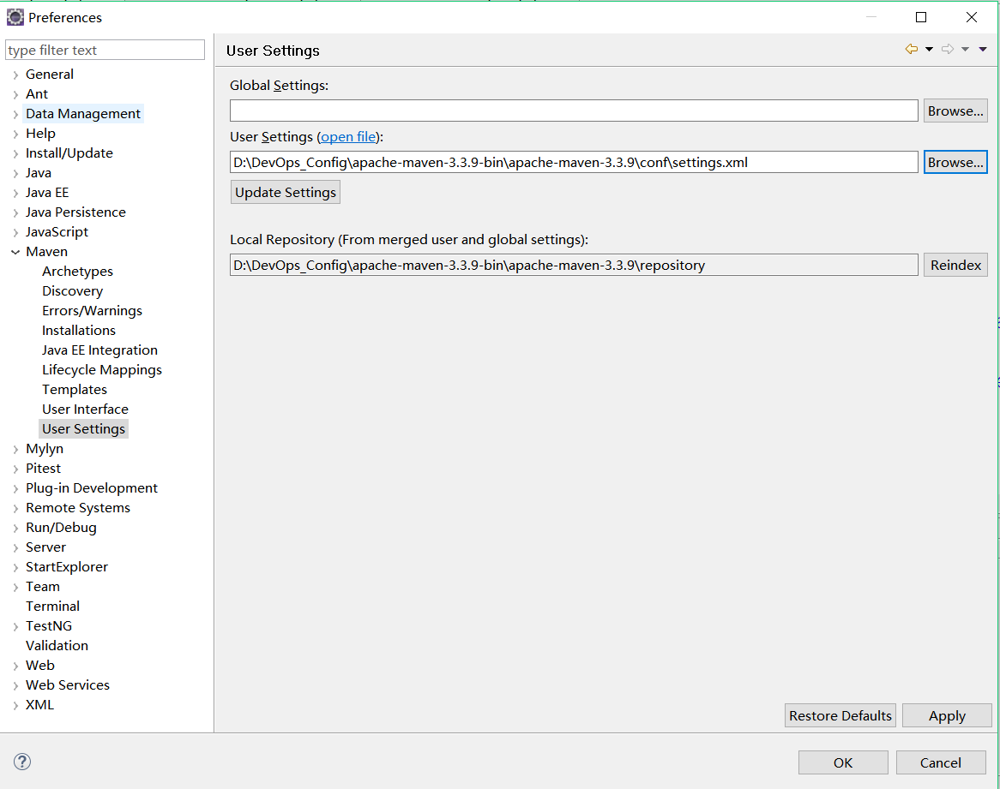

### 6.1、windos&linux_maven

1、windos下maven

下载maven包，版本3.3.9

解压

windos下配置环境变量

```
MAVEN_HOME

D:\Dev\apache-maven-3.3.9-bin_2\apache-maven-3.3.9

PATH

%MAVEN_HOME%\bin;
```


***

2、linux下maven

2.1、  maven下载

下载地址：<https://archive.apache.org/dist/maven/maven-3/3.3.9/binaries/apache-maven-3.3.9-bin.tar.gz>

2.2、  解压配置全局变量

```
vim /etc/profile 

export MAVEN_HOME=/usr/local/apache-maven-3.0.5 

export PATH=$PATH:$JAVA_HOME/bin:$MAVEN_HOME/bin

执行 source /etc/profile 使文件生效

验证：

命令：mvn -version

Apache Maven 3.3.9 (bb52d8502b132ec0a5a3f4c09453c07478323dc5; 2015-11-11T00:41:47+08:00)

Maven home: /Users/zhangyong/Documents/maven/apache-maven-3.3.9
```

***

3、  ecplise中maven配置





***

4、maven本地仓库设置【windos&linux通用】

```
<?xml version="1.0" encoding="UTF-8"?>

<!--
Licensed to the Apache Software Foundation (ASF) under one

or more contributor license agreements.  See the NOTICE file

distributed with this work for additional information

regarding copyright ownership.  The ASF licenses this file

to you under the Apache License, Version 2.0 (the

"License"); you may not use this file except in compliance

with the License.  You may obtain a copy of the License at

http://www.apache.org/licenses/LICENSE-2.0

Unless required by applicable law or agreed to in writing,

software distributed under the License is distributed on an

"AS IS" BASIS, WITHOUT WARRANTIES OR CONDITIONS OF ANY

KIND, either express or implied.  See the License for the

specific language governing permissions and limitations

under the License.

-->

<!--

 | This is the configuration file for Maven. It can be specified at two levels:

 |

 |  1. User Level. This settings.xml file provides configuration for a single user,

 |                 and is normally provided in ${user.home}/.m2/settings.xml.

 |

 |                 NOTE: This location can be overridden with the CLI option:

 |

 |                 -s /path/to/user/settings.xml

 |

 |  2. Global Level. This settings.xml file provides configuration for all Maven

 |                 users on a machine (assuming they're all using the same Maven

 |                 installation). It's normally provided in

 |                 ${maven.home}/conf/settings.xml.

 |

 |                 NOTE: This location can be overridden with the CLI option:

 |

 |                 -gs /path/to/global/settings.xml

 |

 | The sections in this sample file are intended to give you a running start at

 | getting the most out of your Maven installation. Where appropriate, the default

 | values (values used when the setting is not specified) are provided.

 |

 |    

-->

<settings xmlns="http://maven.apache.org/SETTINGS/1.0.0"

          xmlns:xsi="http://www.w3.org/2001/XMLSchema-instance"

          xsi:schemaLocation="http://maven.apache.org/SETTINGS/1.0.0 http://maven.apache.org/xsd/settings-1.0.0.xsd">

  <!-- localRepository

   | The path to the local repository maven will use to store artifacts.

   |

   | Default: ${user.home}/.m2/repository，改路径是windos下的，linux自动更改

    -->

  <localRepository>D:\DevOps_Config\apache-maven-3.3.9-bin\apache-maven-3.3.9\repository</localRepository>

  <!-- interactiveMode

   | This will determine whether maven prompts you when it needs input. If set to false,

   | maven will use a sensible default value, perhaps based on some other setting, for

   | the parameter in question.

   |

   | Default: true

   -->

  <interactiveMode>true</interactiveMode>

  <!-- offline

   | Determines whether maven should attempt to connect to the network when executing a build.

   | This will have an effect on artifact downloads, artifact deployment, and others.

   |

   | Default: false

   -->

  <offline>false</offline>


  <pluginGroups>

        <pluginGroup>org.mortbay.jetty</pluginGroup>

        <pluginGroup>org.jenkins-ci.tools</pluginGroup>

    </pluginGroups>

<servers> 

<!--配置nexus账户-->

  <server>    

      <id>nexus-releases</id>    

      <username>admin</username>    

      <password>xiaolanyun</password>    

    </server>    

    <server>    

      <id>nexus-snapshots</id>    

      <username>admin</username>    

      <password>xiaolanyun</password>    

    </server>    

  </servers> 


  <mirrors>

  	<mirror>

  		<id>nexus-releases</id>

  		<mirrorOf>*</mirrorOf>

  		<url>http://192.168.222.128:8081/repository/maven-public/</url>

  	</mirror>

  	<mirror>

  		<id>nexus-snapshots</id>

  		<mirrorOf>*</mirrorOf>

  		<url>http://192.168.222.128:8081/repository/maven-snapshots/</url>

  	</mirror>

    <!--配置国内镜像-->

<mirror>

  <id>CN</id>

  <name>OSChina Central</name> 

  <url>http://maven.oschina.net/content/groups/public/</url>

  <mirrorOf>central</mirrorOf>

</mirror>

<mirror>

    <id>nexus-aliyun</id>

    <name>Nexus aliyun</name>

    <url>http://maven.aliyun.com/nexus/content/groups/public/</url>

    <mirrorOf>central</mirrorOf>

	</mirror>

  </mirrors>

  <profiles>

  	<profile>

  		<id>jdk-1.8</id>

  		<activation>

  			<activeByDefault>true</activeByDefault>

  			<jdk>1.8</jdk>

  		</activation>

  		<properties>

  			<maven.compiler.source>1.8</maven.compiler.source>

  			<maven.compiler.target>1.8</maven.compiler.target>

  			<maven.compiler.compilerVersion>1.8</maven.compiler.compilerVersion>

  		</properties>

  	</profile>  

   <profile>    

      <id>nexus</id>    

      <repositories>    

        <repository>    

          <id>nexus-releases</id>    

          <url>http://nexus-releases</url>    

          <releases><enabled>true</enabled></releases>    

          <snapshots><enabled>true</enabled></snapshots>    

        </repository>    

        <repository>    

          <id>nexus-snapshots</id>    

          <url>http://nexus-snapshots</url>    

          <releases><enabled>true</enabled></releases>    

          <snapshots><enabled>true</enabled></snapshots>    

        </repository>   

      </repositories>    

      <pluginRepositories>    

         <pluginRepository>    

                <id>nexus-releases</id>    

                 <url>http://nexus-releases</url>    

                 <releases><enabled>true</enabled></releases>    

                 <snapshots><enabled>true</enabled></snapshots>    

               </pluginRepository>    

               <pluginRepository>    

                 <id>nexus-snapshots</id>    

                  <url>http://nexus-snapshots</url>    

                <releases><enabled>true</enabled></releases>    

                 <snapshots><enabled>true</enabled></snapshots>    

             </pluginRepository>    

         </pluginRepositories>    

    </profile>    

  </profiles> 

  <activeProfiles>    

  <activeProfile>nexus</activeProfile> 

  </activeProfiles> 

</settings>
```


