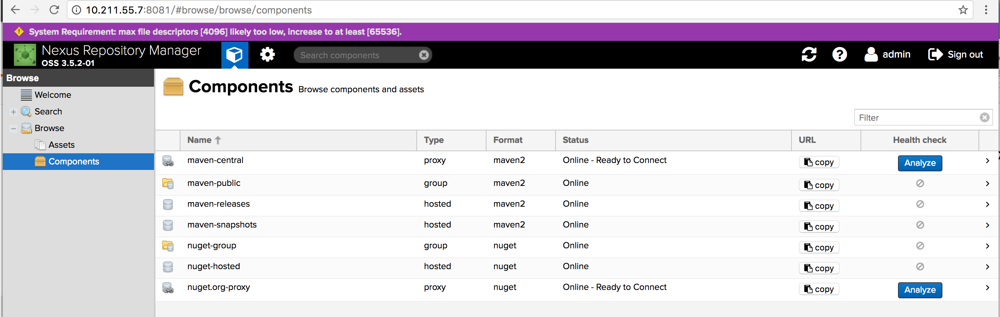

### 6.2、Nexus

一、安装配置Nexus

1、  下载nexus 

<https://www.sonatype.com/download-oss-sonatype> 

***

2、  解压：

```
tar -zxf nexus-3.5.2-01-unix.tar.gz
```

***

3、  进入bin目录启动：./nexus run &

出现如下界面启动成功

\-------------------------------------------------

Started Sonatype Nexus OSS 3.5.2-01

\-------------------------------------------------

***

4、  访问http://192.168.222.128:8081/

可以登录



默认端口号：8081

默认账号：admin

默认密码：admin123

***

5、  配置修改

5.1、修改运行nexus3所使用的用户：

```
[root@bigdata1 bin]#vi nexus.rc

run_as_user=”root”
```

5.2、修改nexus3启动所使用的jdk版本

```
[root@bigdata1 bin]#vi nexus

INSTALL4J_JAVA_HOME_OVERRIDE=/data/program/software/java8
```

5.3、修改nexus3默认端口

```
   [root@bigdata1 etc]# vi nexus-default.properties

  application-port=8282
```

5.4、修改nexus3数据以及相关日志的存储位置

```
    [root@bigdata1 etc]# vi nexus.vmoptions 

    -XX:LogFile=./sonatype-work/nexus3/log/jvm.log

    -Dkaraf.data=./sonatype-work/nexus3

    -Djava.io.tmpdir=./sonatype-work/nexus3/tmp
```

***

6、上传jar包

一、上传jar到nexus

第一种方式：

```
mvn deploy:deploy-file -DgroupId=com.alibaba -DartifactId=dubbo -Dversion=2.8.4 -Dpackaging=jar -Dfile=/Users/zhangyong/Documents/software/dubbo-2.8.4.jar -Durl=http://192.168.222.128:8081/repository/maven-releases/ -DrepositoryId=nexus-releases
```

DrepositoryId和settings.xml里配置的id一样

第二种方式：

代码的pom.xml中直接接入

```
<distributionManagement>  

      <repository>  

            <id>nexus-releases</id>

            <name>maven-releases</name>

          
<url>http://192.168.222.128:8081/repository/maven-releases/</url>

        </repository>  

</distributionManagement> 

 

mvn deploy
```


