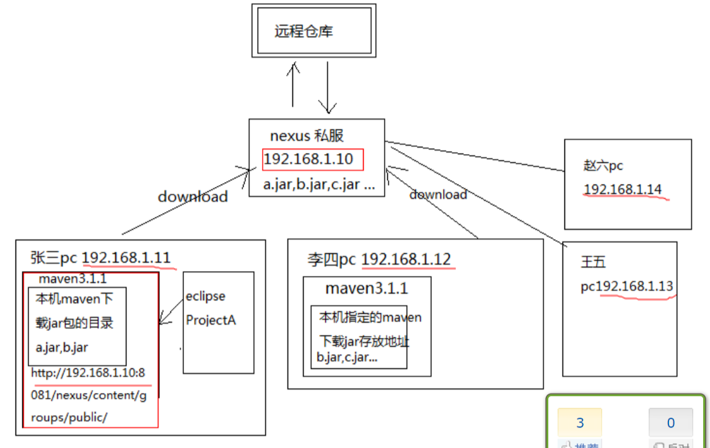

### 6、Nexus

1、Nexus介绍

Nexus 是Maven仓库管理器，如果你使用Maven，你可以从Maven中央仓库 下载所需要的构件（artifact），但这通常不是一个好的做法，你应该在本地架设一个Maven仓库服务器，在代理远程仓库的同时维护本地仓库，以节省带宽和时间，Nexus就可以满足这样的需要。此外，他还提供了强大的仓库管理功能，构件搜索功能，它基于REST，友好的UI是一个extjs的REST客户端，它占用较少的内存，基于简单文件系统而非数据库。这些优点使其日趋成为最流行的Maven仓库管理器。

***

2、使用Nexus原因

​如果没有私服，我们所需的所有构件都需要通过maven的中央仓库和第三方的Maven仓库下载到本地，而一个团队中的所有人都重复的从maven仓库下载构件无疑加大了仓库的负载和浪费了外网带宽，如果网速慢的话，还会影响项目的进程。很多情况下项目的开发都是在内网进行的，连接不到maven仓库怎么办呢？开发的公共构件怎么让其它项目使用？这个时候我们不得不为自己的团队搭建属于自己的maven私服，这样既节省了网络带宽也会加速项目搭建的进程，当然前提条件就是你的私服中拥有项目所需的所有构件。

