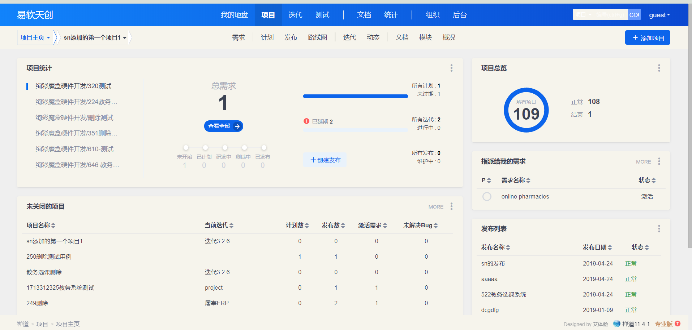

### 7.1、安装部署

注：如果需要开机自动启动，自行编写启动脚本服务。

1、下载

查看linux系统版本

```
uname -a
```

下载相应的包

安装 

***

2、将安装包直接解压到/opt目录下

特别说明：不要 解压到别的目录再拷贝到/opt/，因为这样会导致文件的所有者和读写权限改变， 也不要解压后把整个目录777权限 。

可以使用命令： 

```
sudo tar -zxvf  ZenTaoPMS.7.3.stable.zbox_32.tar.gz -C /opt
```

***

3、Apache和Mysql常用命令

```
执行/opt/zbox/zbox start 命令开启Apache和Mysql。

执行/opt/zbox/zbox stop 命令停止Apache和Mysql。

执行/opt/zbox/zbox restart 命令重启Apache和Mysql。
```

***

更改apache和mysql端口

```
[root@bigdata2 opt]# /opt/zbox/zbox stop

Stop Apache success

Stop Mysql success

[root@bigdata2 opt]# /opt/zbox/zbox -ap 8088 -mp 3307

[root@bigdata2 opt]# /opt/zbox/zbox start
```

***

4、访问和登录禅道

启动 Apache和Mysql服务后，

浏览器直接访问 http://禅道服务器ip:apache端口即可访问和登录禅道。

访问禅道

192.168.222.129:8088

注：如果网页无法访问，请先关闭禅道所在电脑的防火墙和selinux再刷新网页访问试一下。

禅道默认管理员帐号是 admin，密码 123456。

***

5、Android本地商城被测件开发周期

/系统管理员：

删除/添加用户信息

2/10  35.2h 4.4天      2/10 35.2h 4.4天

***

/商户：

商品信息修改，订单详情及发货，修改个人信息

1/10 17.6h 2.2天    1/10 17.6h 2.2天   1/10  17.6h  2.2天

***

/顾客：

浏览商品及购买，查看订单详情，修改个人信息

1/10 17.6h  2.2天    1/10  17.6h  2.2天      1/10 17.6h  2.2天

***

8个功能，

一个月30天，一天8h，4周零2天，4周放8天假，一个月工作22天，共176h

产品经理

2018.11.1-2019.1.1

2018.11.1-2018.12.10，28天，

2018.11.1-11.5

产品需求讨论【管理员：2个需求，卖家：3个需求，买家：3个需求，共8个需求，3天24h】， 

11.6-11.12

美工设计【买家11图，卖家10图，管理员4图，欢迎及登录4图，桌面1图，共30图】【5天40h，一天6图,1.3h】，

11.13-12.10

开发编码【20天160h，8个需求-20h-2天零4h】

2018.12.11-2019.1.1， 16天  

产品测试【16天】，提bug

***

组织结构


***

***

6、禅道功能去除

我的地盘所有功能

产品-路线图

​    -动态

​    -多分支

项目-看板

​    -燃尽图

​    -更多

​    -动态

测试-套件

​    -用例库

统计所有功能

组织-动态

​    -公司

后台-首页

​    -自定义

​    -集成

​    -插件

​    -二次开发

​    -安全

​    -系统

自行修改。

禅道原图：





改变后图：


