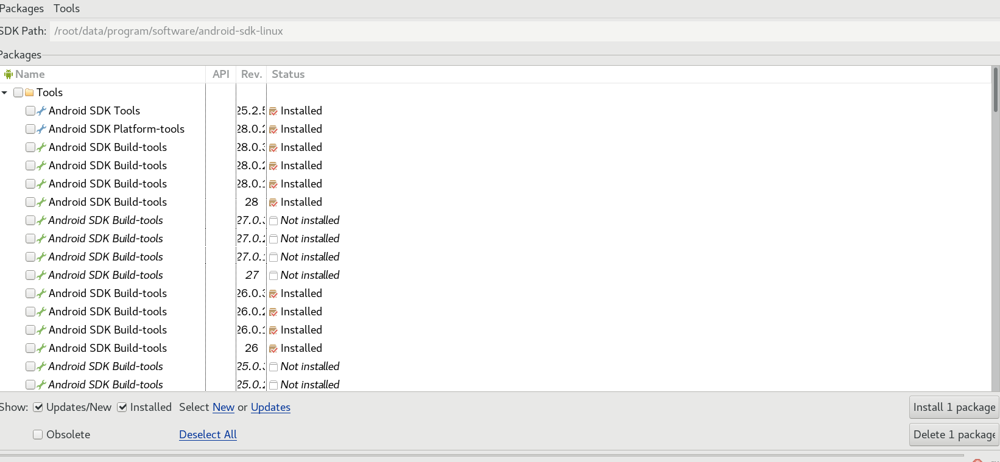
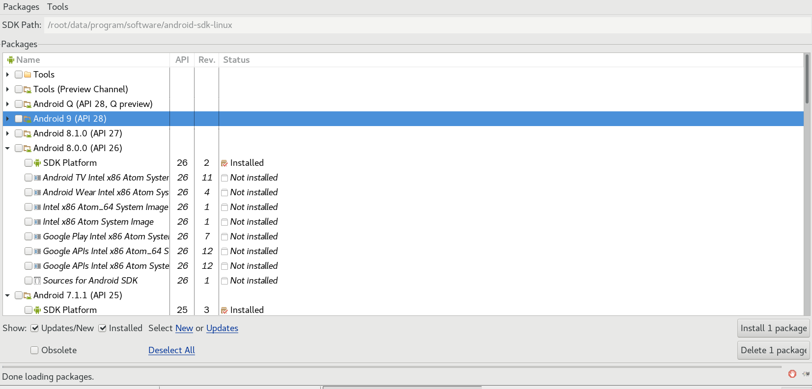
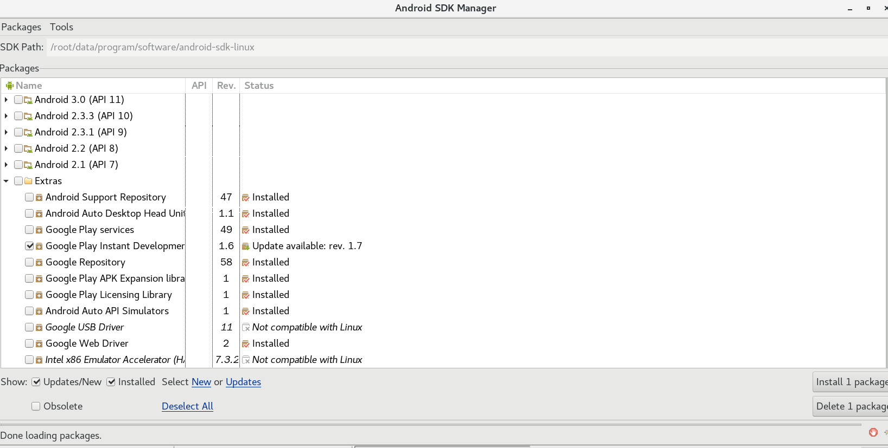

### 8.3、sdk

1、下载

sdk下载

http://dl.google.com/android/android-sdk_r24.4.1-linux.tgz

解压

```
tar -xvf android-sdk_r24.4.1-linux.tgz -C 想解压到的路径
```

进入解压的目录

安装sdk

```
/解压的路径/android/sdk/tools/android update sdk -u
```

配置环境变量

    vim /etc/profile
    输入以下内容：
    export ANDROID_HOME=/解压路径/android/sdk
    export PATH=$PATH:$ANDROID_HOME/tools
    export PATH=$PATH:$ANDROID_HOME/platform-tools
进入android-sdk目录

如/root/data/program/software/android-sdk-linux/tools

打开终端

```
./android
```

选择安装android_sdk版本

Tools安装



androidsdk版本安装,只需要下载SDK Platform即可，其他的不用装。根据自己需要选择安装哪些版本。



Extras安装




