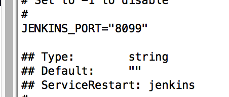
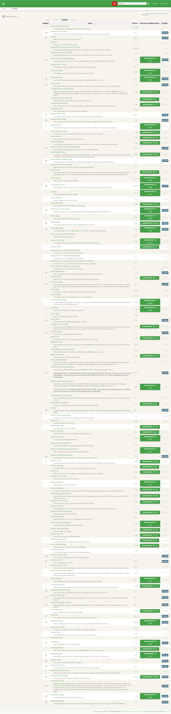
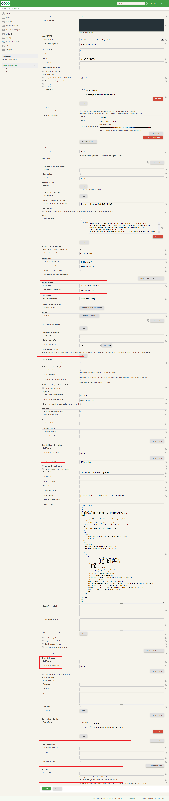
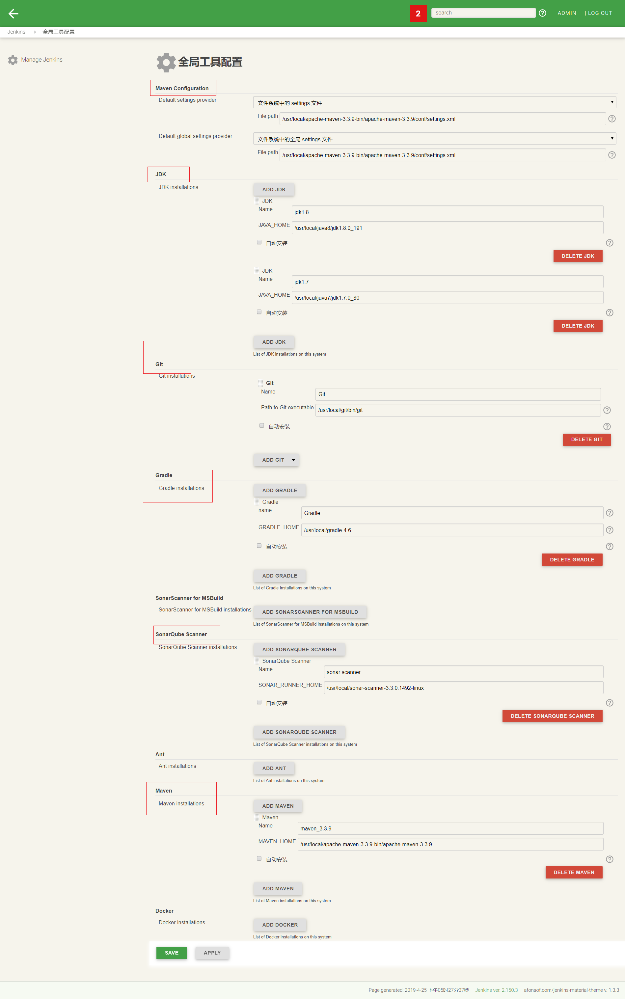
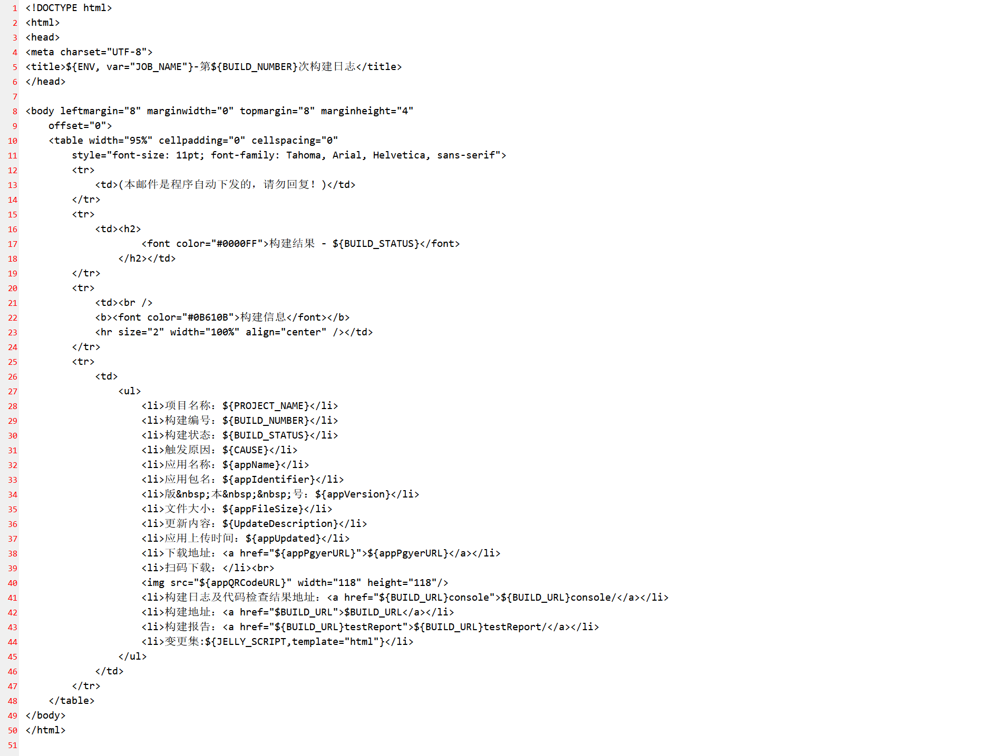
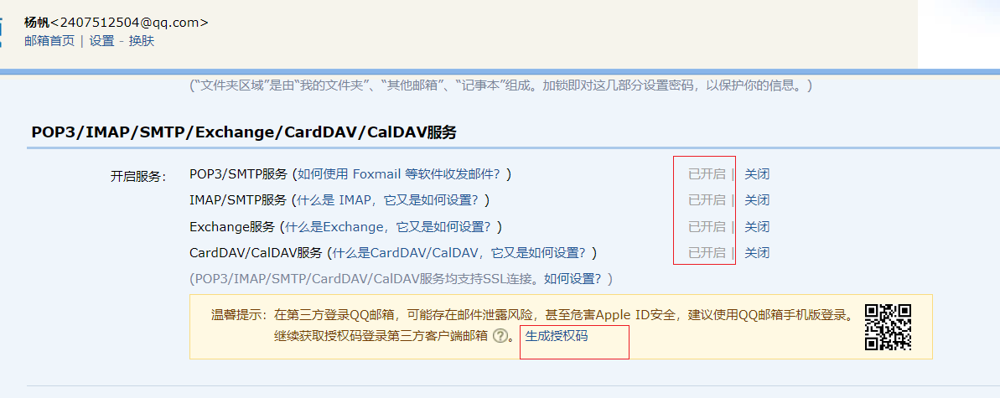
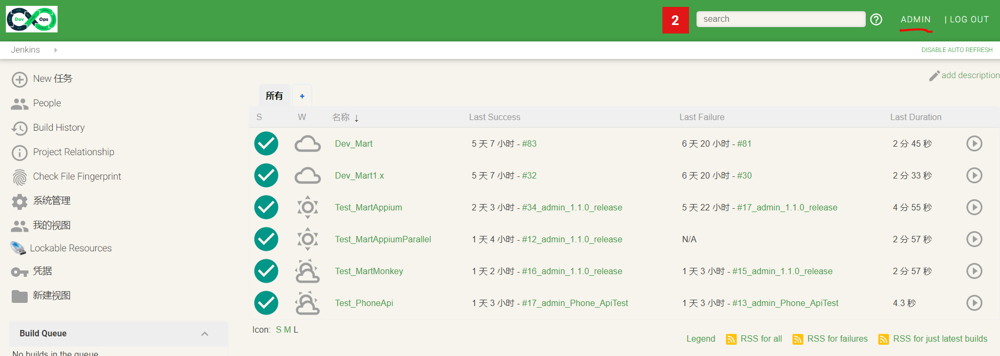
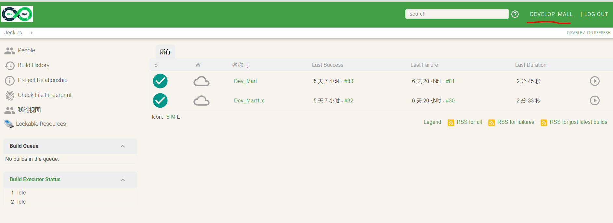
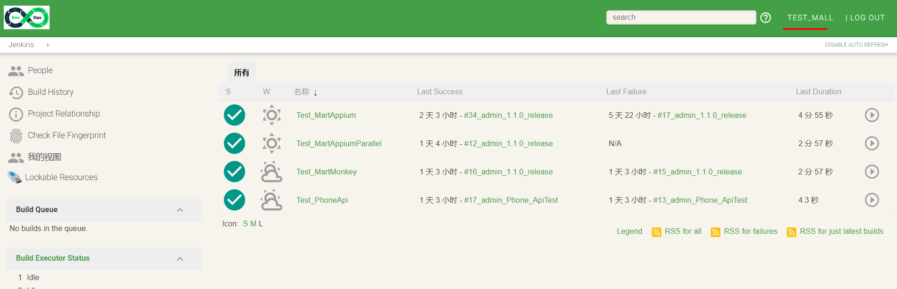

### 8.4、jenkins部署安装

1、下载jenkins的rpm包进行安装

2、修改jenkins的端口号，默认为8080。这里修改为8099。

/etc/sysconfig/jenkins：jenkins配置文件



3、修改jenkins以root用户运行

修改Jenkins配置文件
打开jenkins配置文件:

```
vi /etc/sysconfig/jenkins
将原来的jenkins用户修改为 root用户。
$JENKINS_USER="root"
```

修改Jenkins相关文件夹用户权限
更改jenkins三个文件夹的用户所有都和用户组：

```
chown -R root:root /var/lib/jenkins
chown -R root:root /var/cache/jenkins
chown -R root:root /var/log/jenkins
```

重启Jenkins
重启Jenkins服务并检查运行Jenkins的用户是否已经切换为root。

```
systemctl restart jenkins
查看Jenkins进程所属用户
ps -ef | grep jenkins若显示为root用户，则表示修改完成。
```

***

重启服务 

```
service jenkins restart
```

访问：192.168.222.130:8099

4、jenkins配置

4.1、系统管理-》插件管理,安装插件



4.2、系统管理-》系统设置



4.3、系统管理-》全局工具配置



4.4、系统管理配置详解;

系统管理-》系统设置,采用qq邮箱

**Extended E-mail Notification**

**SMTP server**:smtp.qq.com

**Default user E-mail suffic**:qq.com

**Default Content Type**:HTML(text/html)

**Default recipients**:默认收件人，多人以 , 隔开

**Default Subject**:$PROJECT_NAME - Build # $BUILD_NUMBER - $BUILD_STATUS!

**Default Content**:默认模板



**E-mail Notification**

**SMTP server**:smtp.qq.com

**Default user e-mail suffix**:qq.com

**勾选Use SMTP Authentication**

**User Name**:2407512504@qq.com

**Password**:【需要去qq邮箱-》这是-》账户-》开启服务->生成授权码，密码就是授权码】



**打勾Use SSL**

**SMTP Port**:465

**Charset**:UTF-8

***

**Console Output Parsing **【控制台输出解析】

解析文件：自己创建/root/data/program/software/parsing_rules/rules

文件内容：

```
ok /not really/

match line starting with 'error ', case-insensitive

error /[Ee]rror/
error /ERROR/

list of warnings here...

warning /[Ww]arning/
warning /WARNING/

create a quick access link to lines in the report containing 'INFO'

info /INFO/

each line containing 'BUILD' represents the start of a section for grouping errors and warnings found after the line.

also creates a quick access link.

start /BUILD/
```

***

4.5、其他配置

[jenkins和github配置ssh密公钥和私钥](<https://www.jianshu.com/p/3ce69c25a92b>)

***

4.6、jenkins权限控制

[jenkins权限控制](https://www.cnblogs.com/peng-lan/p/9809644.html)

实践:







***

4.7、插件记录：

Amazon Web Services SDK

This plugin provides AWS SDK for Java for other plugins.

此插件为其他插件提供AWS SDK for Java。

1.11.457          

***

AnsiColor

Adds ANSI coloring to the Console Output

将ANSI着色添加到控制台输出

0.6.2                 

***

Ant Plugin

Adds Apache Ant support to Jenkins

向Jenkins添加Apache Ant支持

1.9            

***

Apache HttpComponents Client 4.x API Plugin

Bundles Apache HttpComponents Client 4.x and allows it to be used by Jenkins plugins.

捆绑Apache HttpComponents Client 4.x并允许Jenkins插件使用它。

4.5.5-3.0          

***

Authentication Tokens API Plugin

This plugin provides an API for converting credentials into authentication tokens in Jenkins.

此插件提供了一个API，用于将凭据转换为Jenkins中的身份验证令牌。

1.3            

***

Basic Branch Build Strategies Plugin

This plugin provides some basic branch build strategies for use with Branch API based projects.

这个插件为基于分支API的项目提供了一些基本的分支构建策略。

1.3.0        

DOWNGRADE TO 1.2.0

***

bouncycastle API Plugin

This plugin provides an stable API to Bouncy Castle related tasks.

这个插件提供了一个稳定的API来执行与Bouny城堡相关的任务。

2.17          

***

Branch API

This plugin provides an API for multiple branch based projects.

这个插件为多个基于分支的项目提供了一个API。

2.3.0        

DOWNGRADE TO 2.2.0

***

Build Name Setter

This plug-in sets the display name of a build to something other than #1, #2, #3, ...

此插件将构建的显示名称设置为#1、#2、#3、.

1.7.1        

DOWNGRADE TO 1.7.0

***

Build Timeout

This plugin allows builds to be automatically terminated after the specified amount of time has elapsed.

此插件允许在经过指定时间后自动终止生成。

1.19          

***

CloudBees AWS Credentials Plugin

Allows storing Amazon IAM credentials within the Jenkins Credentials API. Store Amazon IAM access keys (AWSAccessKeyId and AWSSecretKey) within the Jenkins Credentials API. Also support IAM Roles and IAM MFA Token.

允许在Jenkins凭据API中存储AmazonIAM凭据。在Jenkins凭据API中存储AmazonIAM访问密钥(AWSAccessKeyId和AWSeshKey)。还支持IAM角色和IAMMFA令牌。

1.26 

DOWNGRADE TO 1.24

***

Command Agent Launcher Plugin

Allows agents to be launched using a specified command.

允许使用指定的命令启动代理。

1.3   

DOWNGRADE TO 1.2

***

Credentials Binding Plugin

Allows credentials to be bound to environment variables for use from miscellaneous build steps.

允许凭据绑定到环境变量，以便从其他构建步骤中使用。

1.18 

DOWNGRADE TO 1.17

***

Credentials Plugin

This plugin allows you to store credentials in Jenkins.

这个插件允许您在Jenkins中存储凭据。

2.1.18               

***

Date Parameter Plugin

This plugin allows build parameters with dynamically generated date values.

此插件允许具有动态生成日期值的生成参数。

0.0.4                 

***

description setter plugin

This plugin sets the description for each build, based upon a RegEx test of the build log file.

此插件基于生成日志文件的regex测试为每个构建设置说明。

1.10          

***

Display URL API

Provides the DisplayURLProvider extension point to provide alternate URLs for use in notifications

提供DisplayURLProvider扩展点，以提供用于通知的备用URL。

2.3.1        

DOWNGRADE TO 2.3.0

***

Docker Commons Plugin

Provides the common shared functionality for various Docker-related plugins.

为各种Docker相关插件提供共同的共享功能。

1.14 

DOWNGRADE TO 1.13

***

Docker Pipeline

Build and use Docker containers from pipelines.

从管道构建和使用码头容器。

1.18 

DOWNGRADE TO 1.17

***

Durable Task Plugin

Library offering an extension point for processes which can run outside of Jenkins yet be monitored.

库为可以在Jenkins之外运行的进程提供一个扩展点，这些进程可以被监视。

1.29 

DOWNGRADE TO 1.28

***

Dynamic Extended Choice Parameter Plug-In

This plugin is a sample plugin to explain how to write a Hudson plugin.

这个插件是一个示例插件，用来解释如何编写Hudson插件。

1.0.1                 

***

Email Extension Plugin

This plugin is a replacement for Jenkins's email publisher. It allows to configure every aspect of email notifications: when an email is sent, who should receive it and what the email says

这个插件取代了Jenkins的电子邮件发行商。它允许配置电子邮件通知的每个方面：当电子邮件发送时，谁应该接收它，以及电子邮件说什么。

2.66 

DOWNGRADE TO 2.65

***

Email Extension Template Plugin

This plugin allows administrators to create global templates for the Extended Email Publisher.

此插件允许管理员为扩展的电子邮件发行者创建全局模板。

1.1            

***

External Monitor Job Type Plugin

Adds the ability to monitor the result of externally executed jobs

添加监视外部执行作业的结果的能力

1.7            

***

Folders Plugin

This plugin allows users to create "folders" to organize jobs. Users can define custom taxonomies (like by project type, organization type etc). Folders are nestable and you can define views within folders. Maintained by CloudBees, Inc.

这个插件允许用户创建“文件夹”来组织作业。用户可以定义自定义分类法(如按项目类型、组织类型等)。文件夹是不可访问的，您可以在文件夹中定义视图。由CloudBees公司维护。

6.8   

DOWNGRADE TO 6.7

***

Git client plugin

Utility plugin for Git support in Jenkins

Jenkins中Git支持的实用插件

2.7.6        

DOWNGRADE TO 2.7.5

***

Git Parameter Plug-In

Adds ability to choose branches, tags or revisions from git repositories configured in project.

添加从项目中配置的git存储库中选择分支、标记或修订的功能。

0.9.10      

DOWNGRADE TO 0.9.6

***

Git plugin

This plugin integrates Git with Jenkins.

这个插件集成了Git和Jenkins。

3.9.3        

DOWNGRADE TO 3.9.1

***

GIT server Plugin

Allows Jenkins to act as a Git server.

允许Jenkins充当Git服务器。

1.7            

***

GitHub API Plugin

This plugin provides GitHub API for other plugins.

这个插件为其他插件提供了GitHubAPI。

1.95 

DOWNGRADE TO 1.92

***

GitHub Branch Source Plugin

Multibranch projects and organization folders from GitHub. Maintained by CloudBees, Inc.

来自GitHub的多分支项目和组织文件夹。由CloudBees公司维护。

2.4.5        

DOWNGRADE TO 2.4.2

***

GitHub plugin

This plugin integrates GitHub to Jenkins.

这个插件将GitHub集成到Jenkins。

1.29.4      

DOWNGRADE TO 1.29.3

***

Gradle Plugin

This plugin allows Jenkins to invoke Gradle build scripts directly.

此插件允许Jenkins直接调用Gradle生成脚本。

1.31 

DOWNGRADE TO 1.30

***

Gradle Repo plugin

This plugin allows use of Gradle Repo as an SCM tool. A repo binary is required.

此插件允许使用Gradle回购作为SCM工具。需要回购二进制。

1.0.1        

DOWNGRADE TO 1.0.0

***

Infrastructure plugin for Publish Over X

Send build artifacts somewhere.

把构建的文物送到某个地方。

0.22          

***

Jackson 2 API Plugin

This plugin exposes the Jackson 2 JSON APIs to other Jenkins plugins.

这个插件将Jackson 2 JSON API公开给其他Jenkins插件。

2.9.8        

DOWNGRADE TO 2.9.7.1

***

Javadoc Plugin

1.5   

DOWNGRADE TO 1.4

***

JavaScript GUI Lib: ACE Editor bundle plugin

JavaScript GUI Lib: ACE Editor bundle plugin.

JavaScriptGUI Lib：ACE编辑器包插件。

1.1            

***

JavaScript GUI Lib: Handlebars bundle plugin

JavaScript GUI Lib: Handlebars bundle plugin.

JavaScriptGUIlib:handlebundle插件。

1.1.1                 

***

JavaScript GUI Lib: jQuery bundles (jQuery and jQuery UI) plugin

JavaScript GUI Lib: jQuery bundles (jQuery and jQuery UI) plugin.

JavaScriptGUI Lib：jQuery捆绑包(jQuery和jQueryUI)插件。

1.2.1                 

***

JavaScript GUI Lib: Moment.js bundle plugin

JavaScript GUI Lib: Moment.js bundle plugin.

JavaScriptGUI Lib：Moment.js包插件。

1.1.1                 

***

JDK Parameter Plugin

Lets you specify a set of JDKs that can be picked from as a build parameter.

允许您指定一组JDK，这些JDK可以作为构建参数从中选择。

1.0            

***

JDK Tool Plugin

Allows the JDK tool to be installed via download from Oracle's website.

允许通过从Oracle网站下载来安装JDK工具。

1.2   

DOWNGRADE TO 1.1

***

Job Cacher plugin

This plugin enables caching of files on executors from one build to the next. This is helpful for builds that run on docker agents that start from a clean image and download external dependencies to cache folders such as gradle and maven.

此插件允许从一个构建到另一个构建对执行器上的文件进行缓存。这对于从干净映像开始并下载外部依赖项到缓存文件夹(如Gradle和Maven)的停靠代理上运行的构建很有帮助。

1.0            

***

jQuery plugin

This plugin provides an stable version of jQuery Javascript Library

这个插件提供了一个稳定版本的jQueryJavascriptLibrary

1.12.4-0           

***

jQuery UI plugin

This plugin allows you to use jQuery UI on view descriptions.

这个插件允许您在视图描述上使用jQueryUI。

1.0.2                 

***

JSch dependency plugin

Jenkins plugin that brings the JSch library as a plugin dependency, and provides an SSHAuthenticatorFactory for using JSch with the ssh-credentials plugin.

Jenkins插件，它将JSch库作为插件依赖项，并提供了一个SSHAuthenticatorFactory，用于将JSch与ssh-凭据插件一起使用。

0.1.55      

DOWNGRADE TO 0.1.54.2

***

JUnit Plugin

Allows JUnit-format test results to be published.

允许发布JUnit格式的测试结果。

1.27 

DOWNGRADE TO 1.26.1

***

LDAP Plugin

Adds LDAP authentication to Jenkins

将LDAP身份验证添加到Jenkins

1.20          

***

Locale plugin

This plugin lets you control the language of Jenkins.

这个插件可以让你控制Jenkins的语言。

1.4            

***

Lockable Resources plugin

This plugin allows to define external resources (such as printers, phones, computers) that can be locked by builds. If a build requires an external resource which is already locked, it will wait for the resource to be free.

此插件允许定义外部资源(如打印机、电话、计算机)，这些资源可以被构建锁定。如果构建需要已经锁定的外部资源，它将等待资源空闲。

2.5   

DOWNGRADE TO 2.4

***

Log Parser Plugin

Parses the console log generated by a build

解析由生成的控制台日志。

2.0            

***

Mailer Plugin

This plugin allows you to configure email notifications for build results

此插件允许您为生成结果配置电子邮件通知。

1.23 

DOWNGRADE TO 1.22

***

MapDB API Plugin

This plugin provides a shared dependency on the MapDB library so that other plugins can co-operate when using this library.

此插件提供了对MAPPDB库的共享依赖性，以便在使用此库时其他插件可以合作。

1.0.9.0              

***

Matrix Authorization Strategy Plugin

Offers matrix-based security authorization strategies (global and per-project).

提供基于矩阵的安全授权策略（全局和每个项目）。

2.3            

***

Matrix Project Plugin

Multi-configuration (matrix) project type.

多配置(矩阵)项目类型。

1.14 

DOWNGRADE TO 1.13

***

Maven Integration plugin

This plug-in provides, for better and for worse, a deep integration of Jenkins and Maven: Automatic triggers between projects depending on SNAPSHOTs, automated configuration of various Jenkins publishers (Junit, ...).

这个插件提供了Jenkins和Maven的深度集成：项目之间的自动触发器(取决于快照)、各种Jenkins发布者的自动配置(JUnit，.)。

3.2            

***

OWASP Dependency-Check Plugin

This plug-in can independently execute a Dependency-Check analysis and visualize results.

Dependency-Check is a utility that identifies project dependencies and checks if there are any known, publicly disclosed, vulnerabilities. This tool can be part of the solution to the OWASP Top 10 2013: A9 - Using Components with Known Vulnerabilities.

此插件可以独立执行依赖项检查分析和可视化结果。相关性检查是一种实用工具，它标识项目依赖关系，并检查是否存在任何已知的、公开披露的漏洞。该工具可以作为OWASP 2013年度前10名解决方案的一部分：A9-使用具有已知漏洞的组件。

4.0.2                 

***

OWASP Dependency-Track Plugin

This plug-in publishes software bill-of-material (BOM) to Dependency-Track for continuous analysis. This plugin supports CycloneDX and SPDX BOM formats in addition to Dependency-Check XML reports.

Dependency-Track is an intelligent Software Composition Analysis (SCA) platform that allows organizations to identify and reduce risk from the use of third-party and open source components.

这个插件发布软件材料清单(BOM)到依赖跟踪连续分析.这个插件除了支持依赖检查XML报告之外，还支持CycloneDX和SPDXBOM格式。依赖-跟踪是一个智能软件组合分析(SCA)平台，允许组织识别和减少使用第三方和开源组件的风险。

2.1.0        

DOWNGRADE TO 2.0.2

***

OWASP Markup Formatter Plugin

Uses the OWASP Java HTML Sanitizer to allow safe-seeming HTML markup to be entered in project descriptions and the like.

使用OWASP Java HTML清洗剂允许在项目描述等中输入安全的HTML标记。

1.5            

***

PAM Authentication plugin

Adds Unix Pluggable Authentication Module (PAM) support to Jenkins

将UNIX可插入身份验证模块(PAM)支持添加到Jenkins

1.5   

DOWNGRADE TO 1.4

***

Pipeline

A suite of plugins that lets you orchestrate automation, simple or complex. See Pipeline as Code with Jenkins for more details.

一套插件，让您编排自动化，简单或复杂。有关更多细节，请参见管道与Jenkins的代码。

2.6            

***

Pipeline Graph Analysis Plugin

Provides a REST API to access pipeline and pipeline run data.

提供RESTAPI来访问管线和管线运行数据。

1.9            

***

Pipeline: API

Plugin that defines Pipeline API.

定义管线API的插件。

2.33          

***

Pipeline: Basic Steps

Commonly used steps for Pipelines.

管道常用的步骤。

2.15 

DOWNGRADE TO 2.14

***

Pipeline: Build Step

Adds the Pipeline step build to trigger builds of other jobs.

添加管道步骤生成以触发其他作业的生成。

2.8   

DOWNGRADE TO 2.7

***

Pipeline: Declarative

An opinionated, declarative Pipeline.

固执己见的、声明性的管道。

1.3.7        

DOWNGRADE TO 1.3.6

***

Pipeline: Declarative Agent API

Replaced by Pipeline: Declarative Extension Points API plugin.

由管道取代：声明性扩展点API插件。

1.1.1                 

***

Pipeline: Declarative Extension Points API

APIs for extension points used in Declarative Pipelines.

用于声明性管道中的扩展点的API。

1.3.7        

DOWNGRADE TO 1.3.7

***

Pipeline: GitHub Groovy Libraries

Allows Pipeline Grrovy libraries to be loaded on the fly from GitHub.

允许从GitHub动态加载管道Grrovy库。

1.0            

***

Pipeline: Groovy

Pipeline execution engine based on continuation passing style transformation of Groovy scripts.

基于Groovy脚本的连续传递样式转换的管道执行引擎。

2.65 

DOWNGRADE TO 2.64

***

Pipeline: Input Step

Adds the Pipeline step input to wait for human input or approval.

添加管道步骤输入以等待人工输入或批准。

2.10 

DOWNGRADE TO 2.9

***

Pipeline: Job

Defines a new job type for pipelines and provides their generic user interface.

为管道定义新的作业类型，并提供它们的通用用户界面。

2.32 

DOWNGRADE TO 2.31

***

Pipeline: Milestone Step

Plugin that provides the milestone step

提供里程碑步骤的插件

1.3.1                 

***

Pipeline: Model API

Model API for Declarative Pipeline.

声明性管道的模型API。

1.3.7        

DOWNGRADE TO 1.3.7

***

Pipeline: Multibranch

Enhances Pipeline plugin to handle branches better by automatically grouping builds from different branches.

通过从不同的分支自动分组，增强了管道插件以更好地处理分支。

2.21 

DOWNGRADE TO 2.20

***

Pipeline: Nodes and Processes

Pipeline steps locking agents and workspaces, and running external processes that may survive a Jenkins restart or slave reconnection.

管道步骤锁定代理和工作区，并运行可能在Jenkins重新启动或从重新连接中存活的外部进程。

2.30 

DOWNGRADE TO 2.29

***

Pipeline: REST API Plugin

Provides a REST API to access pipeline and pipeline run data.

提供RESTAPI来访问管线和管线运行数据。

2.10          

***

Pipeline: SCM Step

Adds a Pipeline step to check out or update working sources from various SCMs (version control).

添加管道步骤，以签出或更新来自各种SCM(版本控制)的工作源。

2.7            

***

Pipeline: Shared Groovy Libraries

Shared libraries for Pipeline scripts.

管道脚本的共享库。

2.13 

DOWNGRADE TO 2.12

***

Pipeline: Stage Step

Adds the Pipeline step stage to delineate portions of a build.

添加管道步骤阶段来描述生成的部分。

2.3            

***

Pipeline: Stage Tags Metadata

Library plugin for Pipeline stage tag metadata.

用于管道阶段标记元数据的库插件。

1.3.7        

DOWNGRADE TO 1.3.6

***

Pipeline: Stage View Plugin

Pipeline Stage View Plugin.

管道阶段视图插件。

2.10          

***

Pipeline: Step API

API for asynchronous build step primitive.

用于异步构建步骤原语的API。

2.19 

DOWNGRADE TO 2.17

***

Pipeline: Supporting APIs

Common utility implementations to build Pipeline Plugin

构建管道插件的常见实用程序实现

3.2   

DOWNGRADE TO 3.2

***

Plain Credentials Plugin

Allows use of plain strings and files as credentials.

允许使用普通字符串和文件作为凭据。

1.5   

DOWNGRADE TO 1.4

***

Project Description Setter

Set the project description from a file in the workspace

从工作区中的文件中设置项目描述

1.2            

***

Publish Over SSH

Send build artifacts over SSH

通过SSH发送构建构件

1.20.1               

***

Resource Disposer Plugin

Dispose resources asynchronously. Utility plugin for resources that require more retries or take a long time to delete.

异步配置资源。实用插件的资源，需要更多的重试或需要很长时间来删除。

0.12          

***

Role-based Authorization Strategy

Enables user authorization using a Role-Based strategy. Roles can be defined globally or for particular jobs or nodes selected by regular expressions.

使用基于角色的策略启用用户授权。角色可以在全局范围内定义，也可以为正则表达式选择的特定作业或节点定义。

2.10          

***

SCM API Plugin

This plugin provides a new enhanced API for interacting with SCM systems.

这个插件为与SCM系统交互提供了一个新的增强API。

2.4.1        

DOWNGRADE TO 2.4.0

***

Script Security Plugin

Allows Jenkins administrators to control what in-process scripts can be run by less-privileged users.

允许Jenkins管理员控制哪些进程内脚本可以由特权较低的用户运行.

1.56 

DOWNGRADE TO 1.54

***

secondary timestamper plugin

This plugins sets a secondary timestamp as description in the build history of a job

此插件将次要时间戳设置为作业生成历史记录中的描述。

1.1            

***

Selenium Plugin

3.12.0               

***

Simple Theme Plugin

This plugin allows to customize Jenkin's appearance with custom CSS and JavaScript. It also allows to replace the Favicon.

此插件允许使用自定义CSS和JavaScript自定义Jenkin外观。它还允许替换Favicon。

0.5.1                 

***

SonarQube Scanner for Jenkins

This plugin allows an easy integration of SonarQube, the open source platform for Continuous Inspection of code quality.

该插件允许轻松集成SonarQube，开放源代码平台，用于连续检查代码质量。

2.8.1                 

***


SSH Credentials Plugin

Allows storage of SSH credentials in Jenkins

允许在Jenkins中存储SSH凭据

1.15 

DOWNGRADE TO 1.14

***

SSH plugin

This plugin executes shell commands remotely using SSH protocol.

这个插件使用SSH协议远程执行shell命令。

2.6.1                 

***

SSH Slaves plugin

Allows to launch agents over SSH, using a Java implementation of the SSH protocol.

允许使用SSH协议的Java实现在SSH上启动代理。

1.29.4      

DOWNGRADE TO 1.29.1

***

Static Analysis Utilities

This plug-in provides utilities for the static code analysis plug-ins.

此插件为静态代码分析插件提供实用程序。

1.95          

***

Structs Plugin

Library plugin for DSL plugins that need names for Jenkins objects.

用于需要Jenkins对象名称的DSL插件的库插件。

1.17          

***

Subversion Plug-in

2.12.1               

***

Timestamper

Adds timestamps to the Console Output

将时间戳添加到控制台输出。

1.9   

DOWNGRADE TO 1.8.10

***

Token Macro Plugin

This plug-in adds reusable macro expansion capability for other plug-ins to use.

此插件为其他插件提供了可重用的宏扩展功能.

2.7   

DOWNGRADE TO 2.6

***

Trilead API Plugin

This plugin provides access to Trilead without having to bundle Trilead in Jenkins core

这个插件提供了对trilead的访问，而不必将trilead捆绑在Jenkins内核中。

1.0.3        

DOWNGRADE TO 1.0.1

***

Upload to pgyer

This plug-in upload the apk/ipa file to pgyer

此插件将apk/ipa文件上载到pgyer。

1.31          

***

user build vars plugin

This plugin is used to set user build variables: jenkins user name and id.

这个插件用于设置用户构建变量：Jenkins、用户名和id。

1.5            

***

WMI Windows Agents Plugin

Allows you to setup agents on Windows machines over Windows Management Instrumentation (WMI)

允许您通过WindowsManagementInstrumentation(WMI)在Windows计算机上设置代理

1.4            

***

Workspace Cleanup Plugin

This plugin deletes the project workspace when invoked.

此插件在调用时删除项目工作区。

0.37 

DOWNGRADE TO 0.36

***

ZAP Pipeline Plugin

Control OWASP ZAP through Pipeline & more

通过管道控制OWASP ZAP&更多

1.9   

DOWNGRADE TO 1.5.11

***

Zentimestamp plugin

Plugin that allows the customization of the date and time pattern for the Jenkins BUILD_TIMESTAMP variable.

插件，它允许定制Jenkins Build_Time STAMP变量的日期和时间模式。


