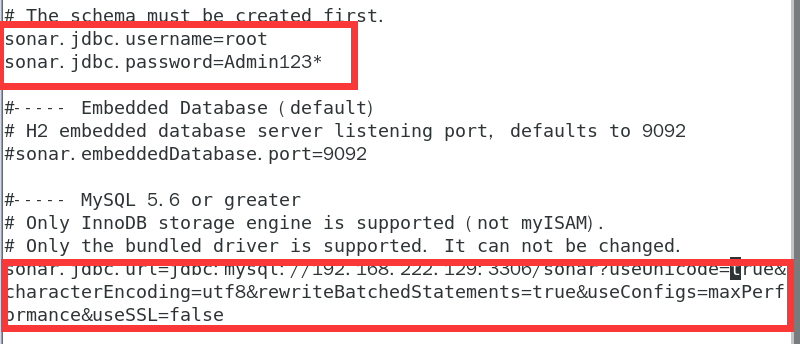
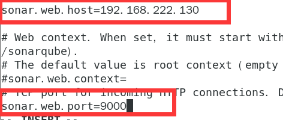

### 9.1、SonarQube

1、环境要求

1.1、jdk1.8

1.2、SonarQube不得在root账户下运行

1.3、

```
vm.max_map_count  大于或等于  262144
fs.file-max  大于或等于  65536
运行SonarQube的用户可以打开至少  65536个 文件描述符
运行SonarQube的用户可以打开至少2048个线程，
seccomp已编译 到内核中
内核参数
您可以使用以下命令查看值：
sysctl vm.max_map_count
sysctl fs.file-max
ulimit -n
ulimit -u
您可以通过以root身份运行以下命令，为当前会话动态设置它们  ：
sysctl -w vm.max_map_count=262144
sysctl -w fs.file-max=65536
ulimit -n 65536
ulimit -u 2048
要更永久地设置这些值，您必须更新  /etc/sysctl.d/99-sonarqube.conf  （或   您希望的/etc/sysctl.conf）以反映这些值。
如果运行SonarQube（ 本例中为sonarqube）的用户没有至少65536个开放描述符的权限，则必须在/etc/limits.d/99-sonarqube.conf  （或  /etc/limits.conf）中插入此行。   如你所愿） ：
sonarqube   -   nofile   65536
sonarqube   -   nproc    2048
```

***

seccomp过滤器
默认情况下，Elasticsearch 使用的是seccomp过滤器。在大多数发行版中，此功能在内核中激活，但在Red Hat Linux 6等发行版中，此功能已停用。如果您使用的是没有此功能的发行版，并且无法升级到激活了seccomp的较新版本，则必须通过更新sonar.properties中的sonar.search.javaAdditionalOpts 来显式停用此安全层  ：

```
sonar.search.javaAdditionalOpts=-Dbootstrap.system_call_filter=false您可以使用以下命令检查内核上是否有seccomp：
$ grep SECCOMP /boot/config-$(uname -r)
如果你的内核有seccomp，你会看到：
CONFIG_HAVE_ARCH_SECCOMP_FILTER=y
CONFIG_SECCOMP_FILTER=y
CONFIG_SECCOMP=y
```

***

2、安装

2.1、下载解压到/usr/local下

```
unzip -d /usr/local sonarqube-6.7.6.zip
```

2.2、配置环境变量

```
vi /etc/profile

export SONAR_HOME=/usr/local/sonarqube-6.7.6

export PATH=$PATH:${SONAR_HOME}/bin

保存

立即生效

source /etc/profile
```

2.3、修改配置文件

连接bigdata3的mysql5.7

```
cd /usr/local/sonarqube-6.7.6/conf

vi sonar.properties
```






***

3、新建用户sonar，密码xiaolanyun

终端：

```
adduser sonar

passwd sonar

对创建的新用户进行sudo操作授权

#搜索sudoers文件

whereis sudoers

#查看权限

ls -l /etc/sudoers

#只有可读权限

#加入可写权限

chmod -v u+w /etc/sudoers

#将sonar用户添加到sudoers文件中

vi /etc/sudoers

sonar ALL=(ALL) ALL

#将sudoers文件权限改回去

chmod -v u-w /etc/sudoers

#测试新用户sonar进行登陆，使用

su sonar

切换用户 
```

***

4、修改sonarqube-6.7.6目录和用户组为sonar

```
chown -R sonar:sonar sonarqube-6.7.6
```


***

5、设置打开文件数和线程数

```
sudo vi /etc/sysctl.conf

vm.max_map_count=262144

fs.file-max=65536
sysctl -p
重启
sudo vi etc/security/limits.conf
*                soft    nofile          65536
*                hard    nofile          65536
*                soft    nproc           2048
*                hard    nproc           2048
```

重启

查看

```
sysctl vm.max_map_count
sysctl fs.file-max
ulimit -n
ulimit -u
```

***

6、重新启动sonar

```
cd /usr/local/sonarqube-6.7.6

cd /usr/local/sonarqube-6.7.6/bin/linux-x86-64

./sonar.sh stop

 

Stopping SonarQube...

SonarQube was not running.
```


***

7、问题总结

查看日志

```
cd /usr/local/sonarqube-6.7.6/logs

tail -n 100 sonar.log
```

四个日志一个一个排查


