### 9.4、集成

1、jenkins插件管理搜索sonarqube安装

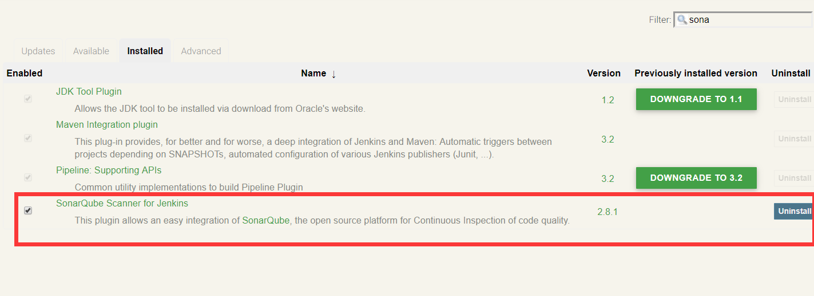

系统管-》系统设置

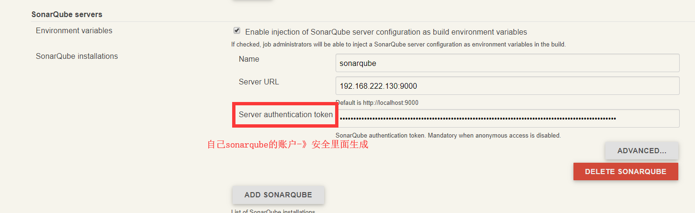

系统管理-》全局工具设置

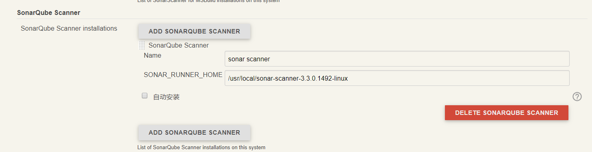

我的视图-》job配置

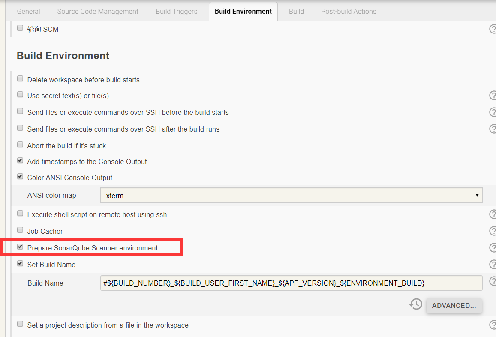

***

```
在构建BUILD中配置 SonarQube Scanner 构建步骤，在 
Task to run 输入框中输入 scan，即分析代码；

JDK 选择框中选择 SonarQube Scanner 使用的 JDK（注意这里必须是 JDK 不能是 JRE）；

Path to project properties 是可选择的输入框，这里可以指定一个 sonar-project.properties 文件，如果不指定的话会使用项目默认的 properties 文件；

Analysis properties 输入框，这里需要输入一些配置参数用来传递给 SonarQube，这里的参数优先级高于 sonar-project.properties 文件里面的参数，所以可以在这里来配置所有的参数以替代 sonar-project.properties 文件，下面列出了一些参数：

sonar.language 指定了要分析的开发语言（特定的开发语言对应了特定的规则），

sonar.sources 定义了需要分析的源代码位置（示例中的$WORKSPACE 所指示的是当前 Jenkins 项目的目录），

sonar.java.binaries 定义了需要分析代码的编译后 class 文件位置；

sonar.projectKey和sonar.projectName一般是项目名

------

[
该字段允许将一些配置参数传递给SonarQube。这里定义的参数优先于指定的声呐-Project.properties文件中可能定义的参数。甚至可以在这里指定所有SonarQube参数，并将“到项目属性的路径”输入字段保持为空。

#unique project identifier (required)

唯一项目标识(Required)
sonar.projectKey=my:project

#project metadata (used to be required, optional since SonarQube 6.1)

项目元数据（用于要求，可选自sonarquis6.1）
sonar.projectName=My project
sonar.projectVersion=1.0

#path to source directories (required)

源目录的路径(必需)
sonar.sources=srcDir1,srcDir2

#path to test source directories (optional)

sonar.tests=testDir1,testDir2
测试源目录的路径（可选）

#path to Java project compiled classes (optional)

Java项目编译类的路径(可选)
sonar.java.binaries=bin

#comma-separated list of paths to libraries (optional)

逗号分隔的库路径列表(可选)
sonar.java.libraries=path/to/library.jar,path/to/classes/dir

#Additional parameters

附加参数
sonar.my.property=value

]

------

在Analysis properties中输入检查规则，以下是运用多个检查项的规则
sonar.projectKey=XiaoLanYunMart_sonar1
sonar.projectName=XiaoLanYunMart
sonar.projectVersion=1.1.0
sonar.sources=app/src/main/java
sonar.java.binaries=app/build/intermediates/javac/release/compileReleaseJavaWithJavac/classes
sonar.language=java
sonar.sourceEncoding=UTF-8
sonar.profile=Android Lint
sonar.login=admin
sonar.password=admin

------

Additional arguments 输入框中可以输入一些附加的参数，
示例中的-X 意思是进入 SonarQube Scanner 的 Debug 模式，这样会输出更多的日志信息；

JVM Options 可以输入在执行 SonarQube Scanner 是需要的 JVM 参数
```

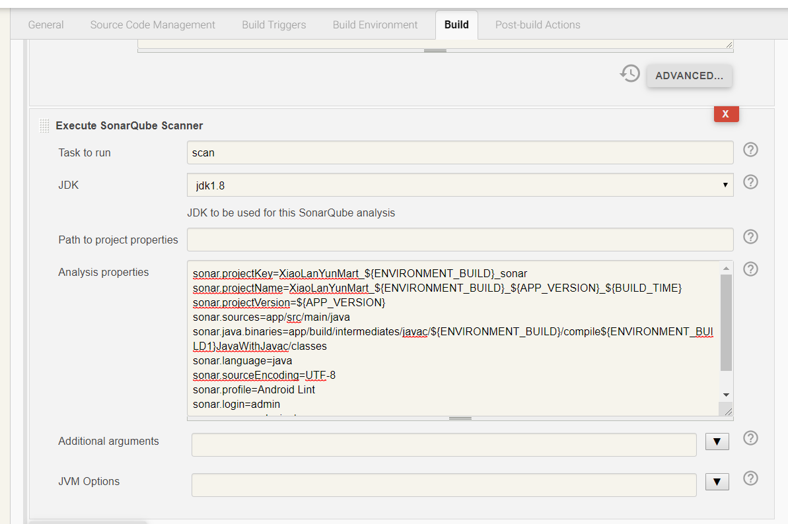

***

2、androidstudio安装sonar lint插件

file->setting->plugins->browse repositories,搜索sonar，安装，重启

继续配置

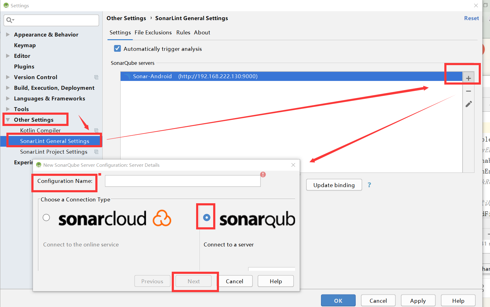

```
sonarqube配置完成后点击update binding
因为sonarqube安装在bigdata3中，所以需要在bigdata3中执行sonar-scanner命令扫描
首先在androidstudio配置sonar-project.properties
sonar.projectKey=XiaoLanYunMart_sonar1
sonar.projectName=XiaoLanYunMart
sonar.projectVersion=1.1.0
sonar.sources=app/src/main/java
sonar.binaries=app/build/intermediates/javac/release/compileReleaseJavaWithJavac/classes
【或者app/build/intermediates/javac/debug/compileDebugJavaWithJavac/classes】
sonar.language=java
sonar.sourceEncoding=UTF-8
sonar.profile=Android Lint
sonar.login=admin
sonar.password=admin

执行build->make project生成class文件app/build/intermediates/javac/release/compileReleaseJavaWithJavac/classes/com/example/xiaolanyun/mart
```


/var/lib/jenkins/workspace/Mart/app/build/intermediates/javac/release/compileReleaseJavaWithJavac/classes/com/example/xiaolanyun/mart/adapters

androidstudio进行git提交，jenkins进行构建更新项目文件
项目在bigdata3中存在地址/var/lib/jenkins/workspace
可以进入其中一个项目根目录

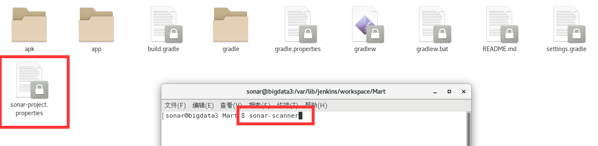

就可以扫描了

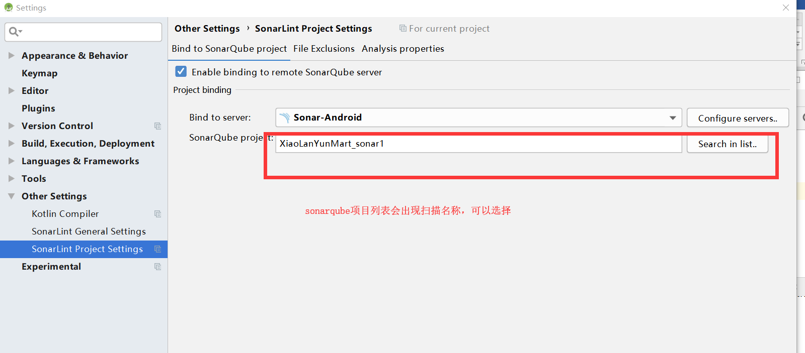

***

3、对sonar-project.properties中属性设置替换变量，避免每次改动造成失败

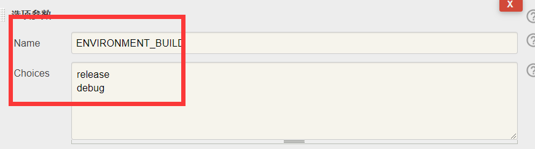

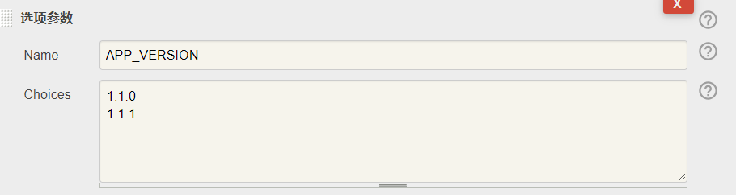

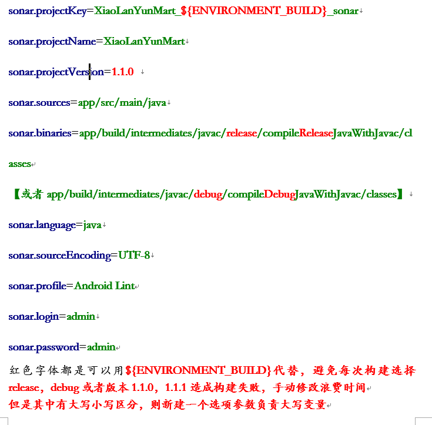

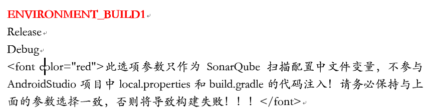

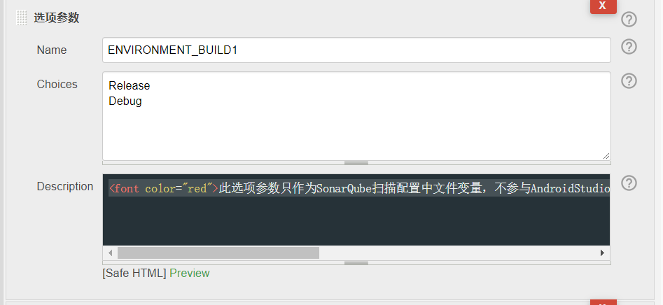

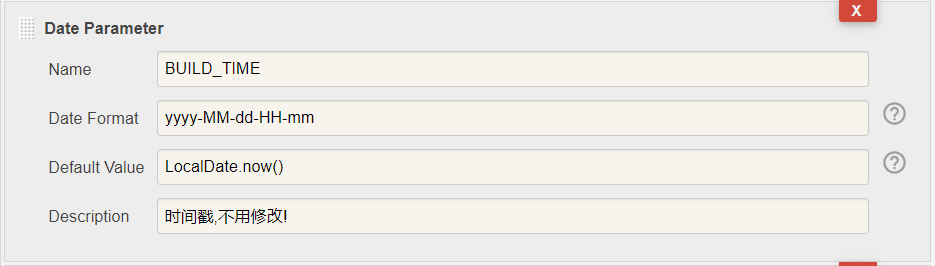

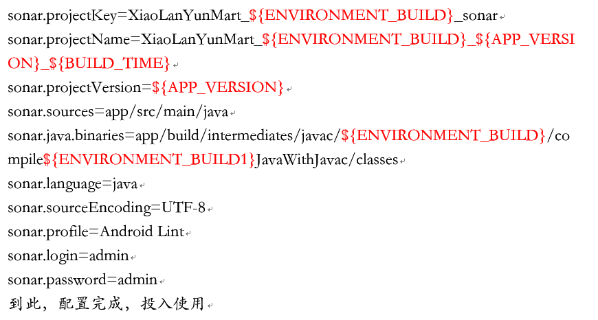

***

4、sonarqube插件推荐下载

Chinese Pack

Findbugs

Git

SonarC#

SonarFlex

SonarTS

Svn

Android

Apigee

Checkstyle

SonarCSS

SonarHTML

SonarJS

SonarJava

SonarPHP

SonarPython

SonarQube :: Plugins :: SCM :: Git

SonarQube :: Plugins :: SCM :: SVN

SonarTS

SonarXML


